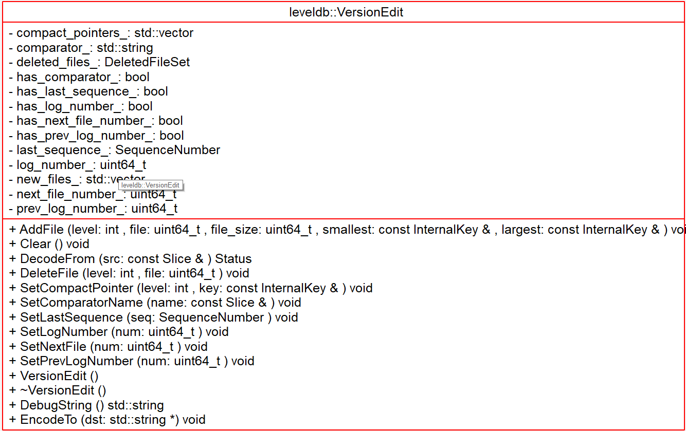
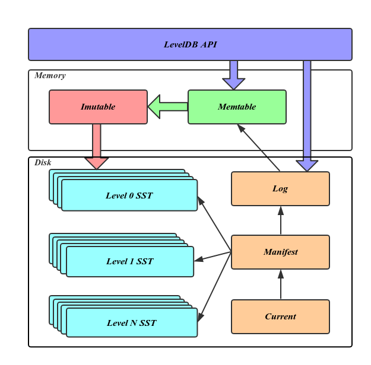

# Manifest & VersionEdit - 2018-11-07 - rsy

- [模块信息](#module_info)
- [模块概要](#module_in_brief)
- [模块功能](#module_function)
- [接口说明](#interface_specification)
- [相关依赖说明](#dependency_specification)
- [内部实现细节](#inner_detail)
- [参考资料](#reference)

&nbsp;   

## 模块信息

`db.version_set.cc`, `db/version_edit.h`, `db/version_edit.cc`

&nbsp;   

## 模块概要

**每一次 compact 都会改变当前 Version，VersionEdit 记录了 Version 的增量。通过 VersionSet::Builder 将 VersionEdit 融进 Version。**

Manifest:
> A MANIFEST file lists the set of sorted tables that make up each level, the corresponding key ranges, and other important metadata. A new MANIFEST file (with a new number embedded in the file name) is created whenever the database is reopened. The MANIFEST file is formatted as a log, and changes made to the serving state (as files are added or removed) are appended to this log.

为了避免进程崩溃或机器宕机导致的数据丢失，LevelDB 需要将元信息数据持久化到磁盘，承担这个任务的就是 Manifest 文件。可以看出每当有新的 Version 产生都需要更新 Manifest，很自然的发现这个新增数据正好对应于 VersionEdit 内容，也就是说 Manifest 文件记录的是一组 VersionEdit 值，在 Manifest 中的一次增量内容称作一个 Block，其内容如下：**就是 VersionEdit 的内容**。

Current:
> CURRENT is a simple text file that contains the name of the latest MANIFEST file.

&nbsp;   

## 模块功能

为了重启 db 后可以恢复退出前的状态，需要将 db 中的状态保存下来，这些状态信息就保存在 manifest 文件中。  
当 db 出现异常时， 为了能够尽可能多的恢复，manifest 中不会只保存当前的状态，而是将历史的状态都保存下来。 又考虑到每次状态的完全保存需要的空间和耗费的时间会较多，当前采用的方式是，只在 manifest 开始保存完整的状态信息（`VersionSet::WriteSnapshot()`），接下来只保存每次
compact 产生的操作（VesrionEdit），重启 db 时，根据开头的起始状态，依次将后续的 VersionEdit replay，即可恢复到退出前的状态（Vesrion）。

将 VersionEdit 加入 Version 时要用到帮助类`class VersionSet::Builder` 中 `Builder::Apply(VersionEdit*)`，使用 `Builder::SaveTo(Version* v)` 把这些version的叠加总和存进去。

&nbsp;   

## 接口说明

**Version 是全量，VersionEdit 是增量**，VersionEdit 中记录了要删除和增加的文件，`pair<int, FileMetaData / uint64_t>` 中 `int` 表示 level。

- `VersionSet::Builder::Apply(VersionEdit*)`：**加入增量**。在 `VersionSet::LogAndApply()` 和 `VersionSet::Recover()` 中调用。
- `VersionSet::Builder::SaveTo(Version*)`：**将结果存入 空Version\*：把 上一个Version 和 Versionedit 中的文件 按顺序 调用MaybeAddFile()**。在 `VersionSet::LogAndApply()` 和 `VersionSet::Recover()` 中调用。
- `VersionSet::Builder::MaybeAddFile(Version*, int level, FileMetaData*)`：**如果不删除 `FileMetaData*`，就加入相应 level**。在前面的 `VersionSet::Builder::SaveTo(Version*)` 中调用。

&nbsp;   

## 相关依赖说明

Manifest 文件：

- 在 `VersionSet::LogAndApply()` 中被刷新（写入）
- 在 `DB::Open()` -> `DBImpl::Recover()` -> `VersionSet::Recover()` 中被读取：
  - 先读 `CURRENT` 文件，其指向当前 Manifest 文件
  - 然后 `log::Reader` 读文件，扔给 `VersionEdit::DecodeFrom()` 读出 `VersionEdit` 即 Manifest

> 话说是不是有个 `status` 处理有啥问题，我把 Manifest 删了，直接 **段错误**？？？   
> 代码里面是 `return Status::Corruption("CURRENT points to a non-existent file", s.ToString());`

&nbsp;   

## 内部实现细节

**我觉得有些实现不如之前数据序列化那里优秀。**   
比如：

- `VersionSet::Builder::Apply()`：
  - for循环中调用size()，solution: 提前放到栈上。
  - x 如果大于 100，x就赋值为 100，solution：不用 if，**不破坏流水线**

    int map[2] = { 100, x };  
    x = map[(x - 100) >> 31];

&nbsp;   

## 参考资料

- [leveldb-handbook](https://leveldb-handbook.readthedocs.io/zh/latest/)
- [leveldb实现解析 - 淘宝-核心系统研发-存储](https://github.com/rsy56640/read_and_analyse_levelDB/blob/master/reference/DB%20leveldb%E5%AE%9E%E7%8E%B0%E8%A7%A3%E6%9E%90.pdf)
- [LevelDB源码分析](https://wenku.baidu.com/view/b3285278b90d6c85ec3ac687.html)
- [leveldb源码分析之version、version_edit和version_set](http://luodw.cc/2015/10/31/leveldb-16/)
- [LevelDB源码解析14. Version的数据结构](https://zhuanlan.zhihu.com/p/44584617)
- [leveldb源码分析之version、version_edit和version_set](http://luodw.cc/2015/10/31/leveldb-16/)
- [版本控制VersionEdit-leveldb源码剖析(13)](http://www.pandademo.com/2016/05/version-control-versionedit-leveldb-source-dissect-13/)
- [庖丁解LevelDB之版本控制](http://catkang.github.io/2017/02/03/leveldb-version.html)