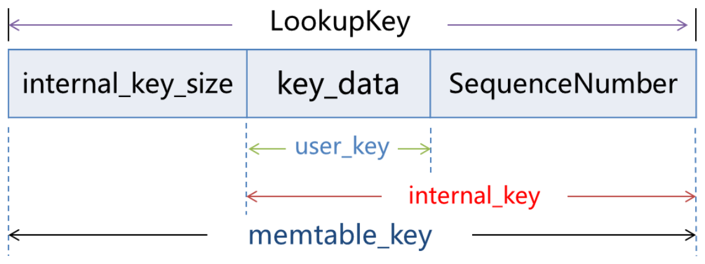
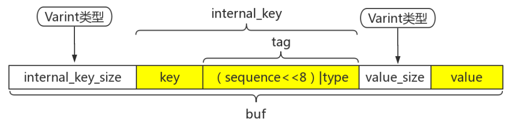
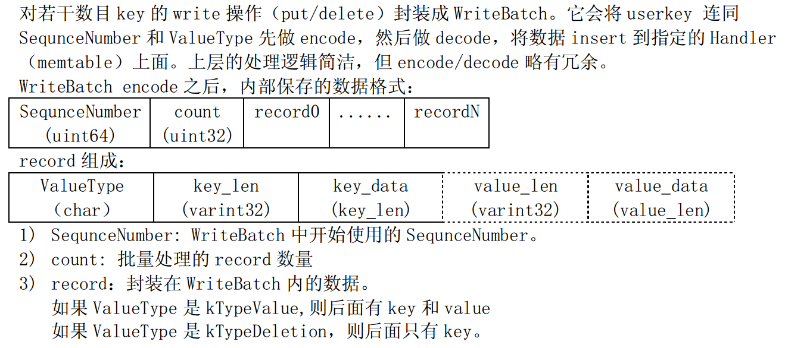
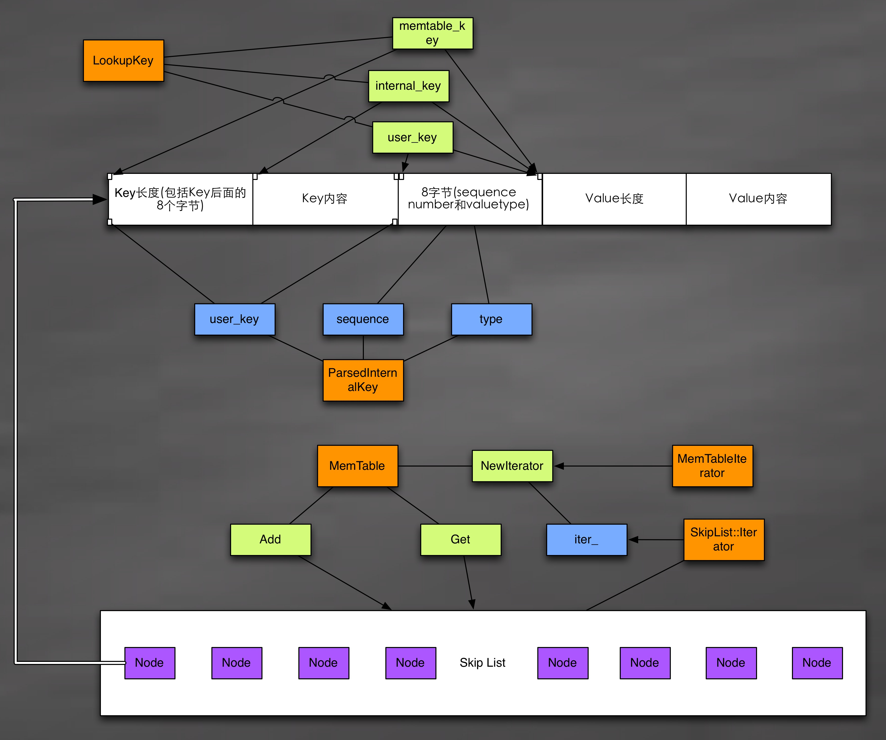

- [Status](#Status)
- [KeyFormat](#KeyFormat)
- [WriteBatch](#WriteBatch)
- [TableCache](#TableCache)
- [Memtable](#Memtable)
- 

&nbsp;   

## [Status](https://github.com/rsy56640/read_and_analyse_levelDB/blob/master/architecture/DB/Status-2018-10-02-dz.md)

Status类封装对db操作返回的结果，除success，都可以包含错误码和两条错误信息。

&nbsp;   

## [KeyFormat](https://github.com/rsy56640/read_and_analyse_levelDB/blob/master/architecture/DB/dbformat_key-2018-10-01-ss.md)

   
   

&nbsp;   

## [WriteBatch](https://github.com/rsy56640/read_and_analyse_levelDB/blob/master/architecture/DB/WriteBatch%20-%202018-10-01%20-%20rsy.md)

leveldb 内部的一个批量写的结构，在 leveldb 为了提高插入和删除的效率，在其插入过程中都采用了批量集合相邻的多个具有相同同步设置的写请求以批量的方式进行写入。

&nbsp;   

## [TableCache](https://github.com/rsy56640/read_and_analyse_levelDB/blob/master/architecture/DB/TableCache%20-%202018-09-30%20-%20rsy.md)

`TableCache` 缓存 `Table` 对象，每个DB一个。

`TableCache` 的 KV 格式：

- 以 `file_number` 作 key
- 以 `TableAndFile` 对应的预加载索引作为 value

table cache 缓存的是 sstable 的索引数据

简单梳理下到 `TableCache` 的查找流程

- 用户提交key查询，交由 `Status DBImpl::Get()` ，获取两种 `MemTable` 和当前 `Version`
- 依次查询 `memtable`、`immutable memtable`
- 未找到则在当前 `Version`上 `Status Version::Get()`，依次从最低level到最高level查询直至查到
- 在每层确定可能包含该key的 SSTable 文件后，就会在所属 `VersionSet` 的 `table_cache` 中继续查询，即调用 `Status TableCache::Get()`

另外，`TableCache` entry 的插入在 Compaction 时也有体现，每当通过 Compatction 生成新的 SSTable 文件，也会以验证正常可用的方式更新该 SSTable 的索引信息到 `TableCache`。

&nbsp;   

## [Memtable](https://github.com/rsy56640/read_and_analyse_levelDB/blob/master/architecture/DB/Memtable%20-%202018-10-04%20-%20rsy.md)

k-v 的实际存储格式：

在 写 level-0 时将 `iter` 传入 `BuildTable` 中写入文件。   
在 leveldb 中，所有内存中的 k-v 数据都存储在 `memtable` 中，物理 disk 则存储在 `SSTable` 中。在系统运行过程中，如果 `memtable` 中的数据占用内存到达指定值(`Options.write_buffer_size`)，则 Leveldb 就自动将 `memtable` 转换为 `immutable memtable`，并自动生成新的 `memtable`，也就是 Copy-On-Write 机制了。
`immutable memtable` 则被新的线程 Dump 到磁盘中， Dump 结束则该 `immutable memtable` 就可以释放了。（所以，同时最多会存在两个  `memtable`）

&nbsp;   

##

&nbsp;   

## 

