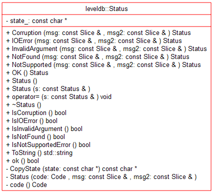

# Status-18-10-02 杜致

- [模块信息](#module_info)
- [模块概要](#module_in_brief)
- [模块功能](#module_function)
- [接口说明](#interface_specification)
- [相关依赖说明](#dependency_specification)
- [内部实现细节](#inner_detail)
- [参考资料](#reference)

&nbsp;

&nbsp;  <a id="module_info"></a>

## 模块信息

include/leveldb/status.h

include/util/status.cc

&nbsp;

<a id="module_in_brief"></a>

## 模块概要

Status类封装对db操作返回的结果，除success，都可以包含错误码和两条错误信息。

&nbsp;

<a id="module_function"></a>

## 模块功能

创建表示状态的对象，支持copy特定Status对象，支持输出错误码和错误信息。


保有一个const char数组state_来存储错误信息。定义enum类型code，0表示success，1-5为错误码。

state\_[0..3]存储消息的长度，state\_[4]存储 code，state\_[5..]存储消息。

在不同线程调用其const method时无需外同步。

&nbsp; &nbsp;

<a id="interface_specification"></a>

## 接口说明


Status() 创建一个success状态，state\_初始化为null。\~Status() 析构函数回收state_。

提供一串static函数创建code不同的error状态，可以传入一条或两条错误信息（slice）。

提供一串用于判断Status对象code的值的函数。

可以通过重载的构造函数或操作符'='来copy Status对象的内容。

string ToString() const 函数，在状态为success时输出”OK“，否则输出”error code: "+"msg: "+"msg2"。

&nbsp;

<a id="dependency_specification"></a>

## 相关依赖说明

需要定义 "leveldb/export.h" "leveldb/slice.h"

操作如Open, Delete, Put, Get, CreateDir, BuildTable, DestroyDB...都要返回状态。

&nbsp;

<a id="inner_detail"></a>

## 内部实现细节

存储错误信息的state_数组代替std::string节省空间。

在ToString() 中检查code，若是未知的值，使用snprintf输出错误消息，snprintf比sprintf安全，防止缓冲区溢出。

错误码：

```
enum Code {
    kOk = 0,
    kNotFound = 1,
    kCorruption = 2,
    kNotSupported = 3,
    kInvalidArgument = 4,
    kIOError = 5
  };
```

&nbsp;

<a id="inner_detail"></a>

## 参考资料

[LevelDB : Status](https://blog.csdn.net/huntinux/article/details/51725569)

[LevelDB源码分析](https://wenku.baidu.com/view/b3285278b90d6c85ec3ac687.html)
