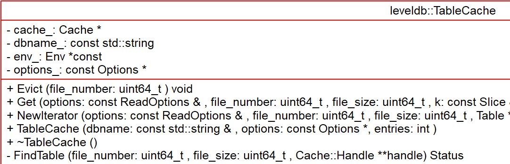

# TableCache - 2018-09-30 rsy

- [模块信息](#module_info)
- [模块概要](#module_in_brief)
- [模块功能](#module_function)
- [接口说明](#interface_specification)
- [相关依赖说明](#dependency_specification)
- [内部实现细节](#inner_detail)
- [参考资料](#reference)

&nbsp;   

## 模块信息

TableCache(`db/table_cache.cc`, `db/table_cache.h`)   

&nbsp;   

## 模块概要

`TableCache` 缓存 `Table` 对象，每个DB一个。

&nbsp;   
 
## 模块功能

&nbsp;   

## 接口说明

- Evict()
- Get()
- NewIterator()

&nbsp;   

## 相关依赖说明

被 `class DBImpl` private含有

&nbsp;   

## 内部实现细节

&nbsp;   

## 参考资料

- [SSTable之两级Cache-leveldb源码剖析(8)](http://www.pandademo.com/2016/04/two-stage-cache-of-sstable-leveldb-source-dissect-8/)
- [leveldb源码分析之Table_cache](http://luodw.cc/2015/10/25/leveldb-13/)
- [Leveldb源码分析--11](https://blog.csdn.net/sparkliang/article/details/8740712)
- 
- 
- 