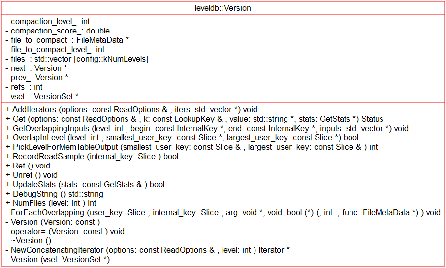
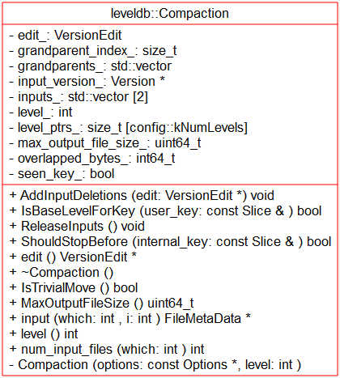
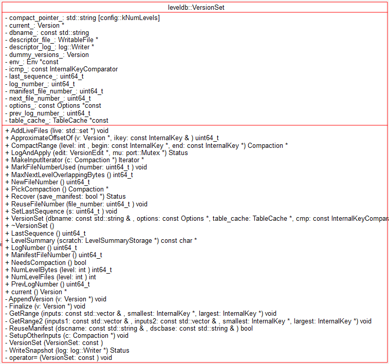
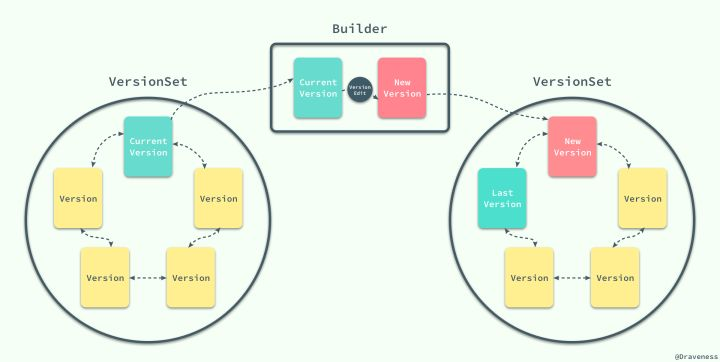

# Version & VersionSet - 2018-11-12 rsy

- [模块信息](#module_info)
- [模块概要](#module_in_brief)
- [模块功能](#module_function)
- [接口说明](#interface_specification)
- [相关依赖说明](#dependency_specification)
- [内部实现细节](#inner_detail)
- [参考资料](#reference)

&nbsp;   

## 模块信息

`db/version_set.h`, `db/version_set.cc`

&nbsp;   

## 模块概要

### 版本控制

保留旧的数据，是为了支持旧版本的查询操作（compact 时发生读操作；不会发生旧版本的写，因为 sequential-writing），于是自然地引入了版本控制的概念。

&nbsp;   

## 模块功能

leveldb 对单版本的 sstable 文件管理，主要集中在 Version 类中。**Version 不会修改其管理的 sstable 文件，只有读取操作**。

将每次 compact 后的最新数据状态定义为 Version，也就是当前 db 元信息以及每个 level 上具有最新数据状态的 sstable 集合。 compact 会在某个 level 上新加入或者删除一些 sstable，但可能这个时候，那些要删除的 sstable 正在被读，为了处理这样的读写竞争情况，基于 sstable 文件一旦生成就不会改动的特点，每个 Version 加入引用计数，读以及解除读操作会将引用计数相应加减一。 这样， db 中可能有多个 Version 同时存在（提供服务） ，它们通过链表链接起来。当 Version 的引用计数为 0 并且不是当前最新的 Version 时，它会从链表中移除， 对应的， 该 Version 内的 sstable 就可以删除了（这些废弃的 sstable 会在下一次 compact 完成时被清理掉）。

**Version 版本类**：   
这个类主要功能

- 首先是提供了在**当前版本搜索键值的 Get 方法** -- `Version::Get()`
- 其次是为上层调用提供了 **收集当前版本所有文件的迭代器** -- `Version::AddIterators()` 
- 为合并文件提供了 **判断键值范围与文件是否有交集** 的辅助函数 -- `Version::OverlapInLevel()`
- 最后是提供了 memtable compact 的 level -- `Version::PickLevelForMemTableOutput()`

Version 是管理某个版本的所有 sstable 的类，就其导出接口而言，无非是遍历 sstable，查找 k/v。以及为 compaction 做些事情，给定 range，检查重叠情况。

> **注意，下面这个图有误，dummy 之后的 Version 是向后添加，current 总是指向 最后一个 Version**    
> 当然你也可以说 prev 指针向右。。。

**VersionSet**：   
管理整个 db 的当前状态，负责包括 Log, Compaction, Recover 等。

&nbsp;   

## 接口说明

- `Version::Get()`：查找 key，存到 value
- `Version::AddIterators()`：为该 Version 中的所有 sstable 都创建一个 Two Level Iterator，以遍历 sstable 的内容
- `Version::GetOverlappingInputs()`：找出指定 level 上与指定区间[`begin`, `end`] overlap 的所有 file
- `Version::OverlapInLevel()`：检查指定 level 中的某些文件是否和 [`smallest_user_key`, `largest_user_key`] 有 overlap
- `Version::PickLevelForMemTableOutput()`：返回我们应该在哪个 level 上放置新的 memtable compaction，这个 compaction覆盖了范围 [`smallest_user_key`, `largest_user_key`]（也就是说 **Memtable Compaction 不一定放在 level-0**）

> Memtable Compaction 不一定放在 level-0，如果 mem 和 level-0、level-1 都没有交集，和 level-2 有交集，就放在 level-1。   
> 也就是说：**如果靠上的 level 和 mem 都没有交集，那么就尽量把 mem 向下 dump**。估计是为了减小 level-0 做 compaction 的压力。

- [`class VersionSet::Builder`](https://github.com/rsy56640/read_and_analyse_levelDB/blob/master/architecture/DB/Manifest%20%26%20VersionEdit%20-%202018-11-07%20-%20rsy.md)：对 Version 应用 VersionEdit 增量
- `VersionSet::Finalize(Version*)`：计算下一次 compaction 最合适的 level
- `VersionSet::LogAndApply()`：应用 VersionEdit 增量，刷新、写入 Manifest 文件，每次 compaction 时调用
- `VersionSet::CompactRange()`：返回一个 Compact*，用于 manual compact
- `VersionSet::PickCompaction()`：返回一个 Compact*，用于自动触发的 compaction；`CompactRange()` 是手动触发
- `VersionSet::Recover()`：从 CURRENT 读 Manifest (VersionEdit)

&nbsp;   

## 相关依赖说明

### `Version::Get()` 调用层次
`DB::Get()` 即 `DBImpl::Get()`，即用户发起查询：

- 先在 mem 找
- 否则在 imm 找
- 否则在 current 找（调用 `TableCache::Get()`），并有可能触发 compaction

### `Version::AddIterators()` 调用层次
`DB::NewIterator()` 即 `DBImpl::NewIterator()` -> `DBImpl::NewInternalIterator()`（加入 mem, imm, version.current 的 iter） -> `Version::AddIterators()`（这里加入 version.current 的 iter）  

### `Version::PickLevelForMemTableOutput()` 调用层次
`DBImpl::CompactMemTable()` / `DBImpl::RecoverLogFile()` -> `DBImpl::WriteLevel0Table` -> `Version::PickLevelForMemTableOutput()`

### `VersionSet::CompactRange()` 调用层次
`DBImpl::MaybeScheduleCompaction()` (schedule 后台线程) -> `DBImpl::BackgroundCompaction()` (**手动** compaction) -> `VersionSet::CompactRange()`

### `VersionSet::PickCompaction()` 调用层次
`DBImpl::MaybeScheduleCompaction()` (schedule 后台线程) -> `DBImpl::BackgroundCompaction()` (**自动触发** compaction) -> `VersionSet::PickCompaction()`

### `VersionSet::Recover()` 调用层次
`DBImpl::Open()` -> `DBImpl::Recover()` -> `VersionSet::Recover()`

&nbsp;   

## 内部实现细节

### `Version::Get()`

- 对于 level-0，有可能 overlap，所以把符合范围（`smallest.user_key` ~ `largest.user_key`）的 file 都收集起来，并且按照 sequence number 排序
- 对于其他 level，直接二分查找

### `Version::AddIterators()`

- 对于 level-0，把所有 sstable 的 iter 都加入（因为有可能overlap）
- 对于其他 level，生成连续的 iter（并且是 lazy open）

然后调用 `TableCache::Get()` 查找

### `Version::PickLevelForMemTableOutput()`
- 如果和 level-0 有交集，就选 level-0
- 否则就尽量向下 dump，直到下一层与 memtable 有交集
- 中间还有个 判断两层之后的玩意，估计是为了减小后面的 overlap，降低 compaction 压力

> 我才知道原来 Memtable Compaction 不一定 dump 到 level-0

### `VersionSet::Finalize(Version*)`
- 对于0层文件，该层的分数为 文件总数 / 4
- 对于非0层文件，该层的分数为 文件数据总量 / 数据总量上限

将得分最高的层数记录，若该得分超过1，则为下一次进行合并的层数。

### `VersionSet::PickCompaction()`
分为 size compaction 和 seek compaction，不过更倾向于 size compaction（原因我猜可能是有了 BloomFilter）

### `VersionSet::Recover()`
参考 [Recover](https://github.com/rsy56640/read_and_analyse_levelDB/blob/master/architecture/DB/Recover%20-%202018-11-08%20-%20rsy.md#%E8%B0%83%E7%94%A8%E6%B5%81%E7%A8%8B)

&nbsp;   

## 参考资料

- [leveldb-handbook](https://leveldb-handbook.readthedocs.io/zh/latest/)
- [leveldb实现解析 - 淘宝-核心系统研发-存储](https://github.com/rsy56640/read_and_analyse_levelDB/blob/master/reference/DB%20leveldb%E5%AE%9E%E7%8E%B0%E8%A7%A3%E6%9E%90.pdf)
- [LevelDB源码分析](https://wenku.baidu.com/view/b3285278b90d6c85ec3ac687.html)
- [LevelDB源码解析6. 版本概念](https://zhuanlan.zhihu.com/p/34674504)
- [LevelDB源码解析10.创建VersionSet](https://zhuanlan.zhihu.com/p/35275467)
- [LevelDB源码解析14. Version的数据结构](https://zhuanlan.zhihu.com/p/44584617)
- [LevelDB源码解析15. Version的数据结构2](https://zhuanlan.zhihu.com/p/44639316)
- [leveldb源码剖析---版本管理](https://blog.csdn.net/Swartz2015/article/details/68062639)
- [庖丁解LevelDB之版本控制](http://catkang.github.io/2017/02/03/leveldb-version.html)
- [leveldb源码分析之version、version_edit和version_set](http://luodw.cc/2015/10/31/leveldb-16/)
- [版本控制VersionEdit-leveldb源码剖析(13)](http://www.pandademo.com/2016/05/version-control-versionedit-leveldb-source-dissect-13/)
- [浅析 Bigtable 和 LevelDB 的实现](https://draveness.me/bigtable-leveldb)