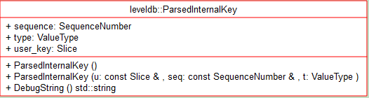
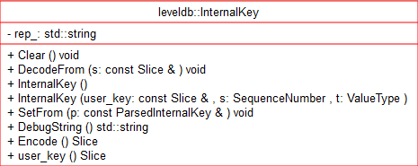
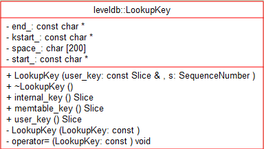

# Module - 2018-10-01 苏胜

- [模块信息](#module_info)
- [模块概要](#module_in_brief)
- [模块功能](#module_function)
- [接口说明](#interface_specification)
- [相关依赖说明](#dependency_specification)
- [内部实现细节](#inner_detail)
- [参考资料](#reference)

&nbsp;   

## 模块信息
ParsedInternalKey(db/dbformat.h,db/dbformat.cc)

InternalKey(db/dbformat.h,db/dbformat.cc)
 
LookupKey(db/dbformat.h,db/dbformat.cc)

&nbsp;   

## 模块概要
1.ParsedInternalKey是db内部操作的key。
 
2.InternalKeydb内部，包装易用的结构，包含userkey与SequnceNumber/ValueType。

3.LookupKey是db内部在为查找memtable/sstable方便，包装使用的key结构，保存有userkey与SequnceNumber/ValueType dump 在内存的数据。
   

## 模块功能

ParsedInternalKey（struct ParsedInternalKey）就是对 InternalKey 分拆后的结果，先来看看 ParsedInternalKey 的成员，

这是一个 struct{

Slice user_key; 

SequenceNumber sequence; 

ValueType type;
}
 

class InternalKey 是一个只存储了一个 string，它使用一个 DecodeFrom() 函数将 Slice 类型的 InternalKey 解码出 string 类型的 InternalKey。  

void DecodeFrom(const Slice& s) { rep_.assign(s.data(), s.size()); } 
 
也就是说 InternalKey 是由 User_key.data + SequenceNumber + ValueType组合而成的。

InternalKey 的格式为： | User_key.data (string)| sequence number (7 B) | value type (1 B) | 

Memtable 的查询接口传入的是 LookupKey（class LookupKey），它也是由 User Key 和 Sequence Number 组合而成的，

从其构造函数：LookupKey(const Slice& user_key, SequenceNumber s)中分析出 LookupKey 的格式为： 

| Size (Varint32)| User key (string) | sequence number (7 bytes) | value type (1 byte) | 

两点： 1.这里的 Size 是 user key 长度+8，相当于 InteralKey 的长度；value type 是 kValueTypeForSeek，它等于 kTypeValue。

2.由于 LookupKey 的 size 是变长存储的，因此它使用 kstart_记录了 user key string的起始地址，否 则将不能正确的获取 size 和 user key； 

&nbsp;   

## 接口说明
1.ParsedInternalKey

DebugString()用于处理ParsedInternalKey成字符串

2.InternalKey

DecodeFrom() 函数将 Slice 类型的 InternalKey 解码出 string 类型的 InternalKey.

Clear()函数清除InternalKey包含的数据

SetFrom()函数创建新的InternalKey结构

3.LookupKey

Slice memtable_key() const { return Slice(start_, end_ - start_); }  
返回一个适合MemTable查找的key。

Slice internal_key() const { return Slice(kstart_, end_ - kstart_); }      
返回一个internal key(适用于传递给内部迭代器)

Slice user_key() const { return Slice(kstart_, end_ - kstart_ - 8); } 返回user key。
其中 start_是 LookupKey 字符串的开始，end_是结束，kstart_是 start_+ sizeof(varint32)，也就是 user key 字符串的起始地址。

&nbsp;   

## 相关依赖说明
需要Slice类型的定义和用法
Slice (include/leveldb/slice.h)

&nbsp;   

## 内部实现细节

LookupKey: 

start：  userkey_len  (varint32)   

kstart：  userkey_data (userkey_len)

end：  SequnceNumber/ValueType (uint64)

对 memtable 进行 lookup 时使用 [start,end], 对 sstable lookup 时使用[kstart, end]。 

&nbsp;   

## 参考资料
- [leveldb实现解析 - 淘宝-核心系统研发-存储](https://github.com/rsy56640/read_and_analyse_levelDB/blob/master/reference/DB%20leveldb%E5%AE%9E%E7%8E%B0%E8%A7%A3%E6%9E%90.pdf)
- [LevelDB源码分析 - 百度文库 100多页..................](https://wenku.baidu.com/view/b3285278b90d6c85ec3ac687.html)
