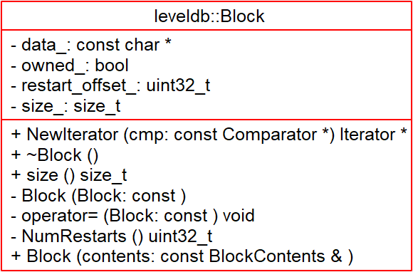
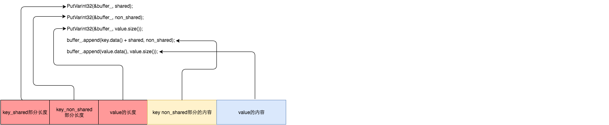
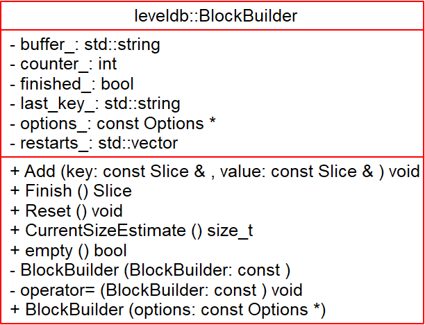

# Block - 2018-10-02 rsy

- [模块信息](#module_info)
- [模块概要](#module_in_brief)
- [模块功能](#module_function)
- [接口说明](#interface_specification)
- [相关依赖说明](#dependency_specification)
- [内部实现细节](#inner_detail)
- [参考资料](#reference)

&nbsp;   

## 模块信息

`table/block.h`, `table/block.cc`, `table/block_builder.h`, `table/block_builder.cc`

&nbsp;   

## 模块概要

`sstable` 中的数据以 `Block` 单位存储，有利于 IO 和解析的粒度。    
提供遍历迭代器(遍历k-v)。

&nbsp;   

## 模块功能

`Block` 内容：

保存了**数据**，**总共大小**，**每一个压缩块的偏移** 和 **总共有多少压缩块**。

- 总共有多少压缩块：读最后一个32位int

每一个 `Record` 内容格式：

   
每一个 record 群中，都对 `key` 的前缀进行了压缩，所以有共享部分和非共享部分。

迭代器 `Block::Iter`：

`BlockBuilder`：

&nbsp;   

## 接口说明

`Block` 的创建：   

`BlockBuilder` 调用 `Add()` 添加 k-v，然后调用 `Finish()` 生成 `BlockContents`。

&nbsp;   

## 相关依赖说明

通过 `BlockHandle` 可定位到该 `Block` 在 sstable 中的 offset 及 size,从而读取出具体的 `Block`（`ReadBlock()`），并解析。   
上层对 `Block` 进行 `key` 的查找和遍历，封装成 `Block::Iter` 处理。

&nbsp;   

## 内部实现细节

**每一组 record 的个数是由 `options_->block_restart_interval` 决定的。**

&nbsp;   
**`Block::Iter`** ：   
应该是为了复用，把所有解析操作都包装在 `Iter::ParseNextKey()` 里面，其他函数基本只是确定 offset，然后调用 `Iter::ParseNextKey()`。    
整个迭代器的遍历操作就是维护大块中小块的位置。   

- `Iter::ParseNextKey()`：向下 decode 出一个 record，并把 `key` 和 `value` 都解析完成。（**注：`key` 的共享长度在每个 record 集合内是非递增的（除了第一个共享长度为 0），因为数据存储保证 "字符串是按字典序递增的"，见 `BlockBuilder::Add()`，所以每次只要把 `key` 的长度缩小成当前的共享长度，然后加上非共享部分**）
- `Iter::Seek()`：二分查找
  - 索引是每一个 `restart`
  - 找到第一个 `key >= target`

&nbsp;    
**`BlockBuilder`**：

- `BlockBuilder::Finish()`：将 `restrat_nums` 和 `restart_size` 添加到 `buffer` 末尾，返回 `BlockContents` 即 `Block` 中的 `data`。
- `BlockBuilder::Add()`：（要求添加的 `key` 是递增的，顺序是上层保证的，由 memtable-dump 或 compact-merge 产生）维护成员 `last_key_`，每次取出 `shared`（如果达到上限就是 0，新开一个 `restart`），然后
> // Add "<shared><non_shared><value_size>" to buffer_   
> // Add string delta to buffer_ followed by value   
> // Update state   维护 last_key_ 和 conuter_

&nbsp;   

## 参考资料

- [leveldb实现解析 - 淘宝-核心系统研发-存储](https://github.com/rsy56640/read_and_analyse_levelDB/blob/master/reference/DB%20leveldb%E5%AE%9E%E7%8E%B0%E8%A7%A3%E6%9E%90.pdf)
- [leveldb](https://dirtysalt.github.io/html/leveldb.html#orgcf948fc)
- [LevelDB源码分析之十二：block](https://blog.csdn.net/caoshangpa/article/details/78977743)
- [LevelDB源码分析](https://wenku.baidu.com/view/b3285278b90d6c85ec3ac687.html)
- [leveldb源码分析--SSTable之block](https://www.cnblogs.com/KevinT/p/3816794.html)
- [LevelDB源码解析17.SST里的Block](https://zhuanlan.zhihu.com/p/45125278)
- [LevelDB源码解析18.Block的Iterator](https://zhuanlan.zhihu.com/p/45217164)
- [LevelDB源码解析20. BlockBuilder](https://zhuanlan.zhihu.com/p/45523142)
- [LevelDB源码解析21. 读取Block](https://zhuanlan.zhihu.com/p/45524806)