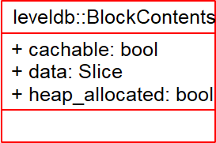
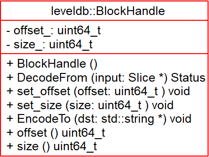
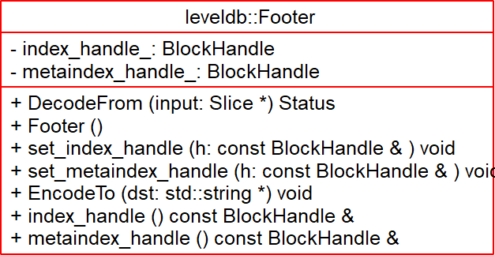
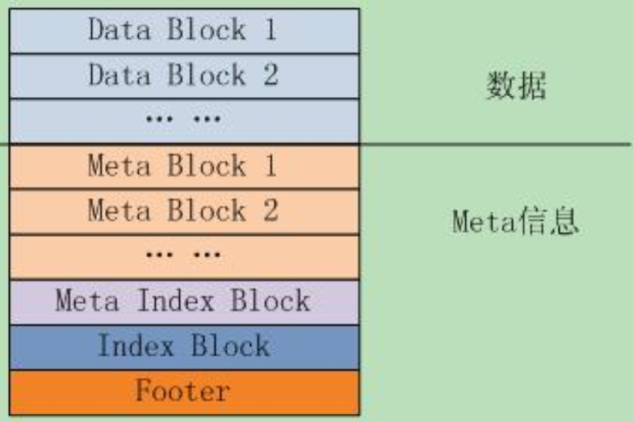
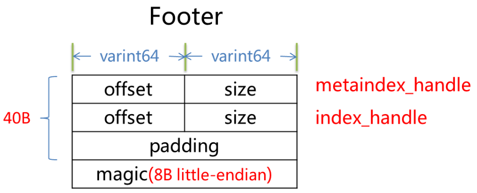

# BlockHandle & Footer - 2018-10-03 rsy

- [模块信息](#module_info)
- [模块概要](#module_in_brief)
- [接口说明](#interface_specification)
- [相关依赖说明](#dependency_specification)
- [内部实现细节](#inner_detail)
- [参考资料](#reference)

&nbsp;   

## 模块信息

`table/format.h`, `table/format.cc`

&nbsp;   

## 模块概要

   
   
   

- `BlockContent` 保存了来自 `BlockBuilder::Finish()` 返回的 block 数据
- `Block` 的元信息（位于 sstable 的 offset/size） 封装成 `BlockHandle`
- `Footer` 用来存储 `meta index block` 与 `index block` 在 sstable 中的索引信息，另外尾部还会存储一个 `magic word`，内容为：http://code.google.com/p/leveldb/ 字符串sha1哈希的前8个字节

&nbsp;   

## 接口说明

`ReadBlock()`：从随机文件里面读取 `Block` 出来，对于这个 `Block` 的位置的话由 `handle` 提供。注意每个 `Block` 后面还有 `crc` 和 `type`，然后将读取的 `Block` 二进制构造 `Block` 对象返回。

&nbsp;   

## 相关依赖说明

在 `Table` 中调用 `ReadBlock()` 读取。

&nbsp;   

## 内部实现细节

`SSTable` 文件格式：   

- `metaindex_handle_`：数据区（data block）索引
- `index_handle_`：meta block 的索引。

&nbsp;   
**`Footer`**：   
   
`Footer` 固定 48B，分别存储 `metaindex_handle` 和 `index_handle` 的当前编码 offser 和 size，相当于 `metaindex` 和 `index` 的索引部分，最后加入8字节的小端编码的 `magic-number`。

- 落盘时会调用 `Footer::EncodeTo()`
- 读取时调用 `Footer::DecodeFrom()`

&nbsp;   
**`ReadBlock()`**：   

参考 [LevelDB源码解析21. 读取Block](https://zhuanlan.zhihu.com/p/45524806)

&nbsp;   

## 参考资料

- [leveldb - BlockHandle](https://dirtysalt.github.io/html/leveldb.html#org70e7f16)
- [leveldb - Footer](https://dirtysalt.github.io/html/leveldb.html#org681caf8)
- [leveldb - ReadBlock](https://dirtysalt.github.io/html/leveldb.html#orgf546f00)
- [leveldb实现解析 - 淘宝-核心系统研发-存储](https://github.com/rsy56640/read_and_analyse_levelDB/blob/master/reference/DB%20leveldb%E5%AE%9E%E7%8E%B0%E8%A7%A3%E6%9E%90.pdf)
- [LevelDB源码解析21. 读取Block](https://zhuanlan.zhihu.com/p/45524806)
- [leveldb-handlebook footer](https://leveldb-handbook.readthedocs.io/zh/latest/sstable.html#footer)
- [SSTable之文件格式及生成-leveldb源码剖析(7)](http://www.pandademo.com/2016/04/sstable-file-format-and-build-leveldb-source-dissect-7/)
- [LevelDB源码解析16.SST文件格式](https://zhuanlan.zhihu.com/p/44954881)