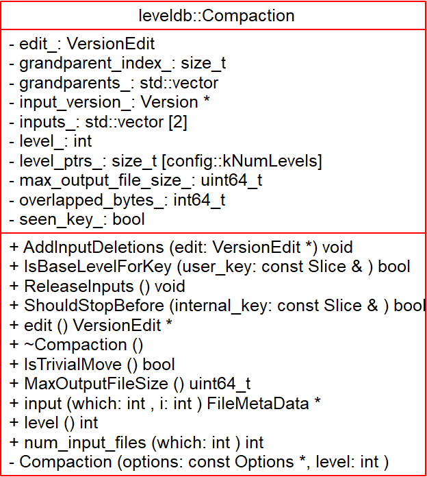

# Compaction - 2018-10-05 rsy

- [模块信息](#module_info)
- [模块概要](#module_in_brief)
- [模块功能](#module_function)
- [接口说明](#interface_specification)
- [相关依赖说明](#dependency_specification)
- [内部实现细节](#inner_detail)
- [参考资料](#reference)

&nbsp;   

## 模块信息

`db/version_set.h`, `db/version_set.cc`

&nbsp;   

## 模块概要

- LevelDB 存储分为两部分，一部分在内存，另一部分在磁盘上。内存中方便快速查找， 查找失败后，去磁盘上查找。一段时间后或内存达到一定大小，会将内存中的 compact 成 .sst 文件存在磁盘
- compaction 是执行 LSM-tree 中 merge 的过程
- 删除操作在 memtable 只是打上删除标记，**真正的删除** 在 compaction 中做
- **minor compaction** 用于内存到外存的迁移过程。level-0 是将 memTable 整个 dump 出来的结果，因此可能之间有相交，这个操作叫 minor compaction
- **major compaction** 用于 level 之间的迁移。major compaction 是将 层i 合到 层i+1 中去，合并是将 层i 中的一块合到整个 层i+1 中去， 这个过程类似归并排序，将参与的几个块全部取出来排序，再重新组合成新的 层i+1，同时 会将重复的 key 弃掉（弃掉是指如果 key 已经出现在更低的层，则高级的层不需要记录这个 key）
  - 对 level > 0 的 sstables，选择其中一个 sstable 与 下一层 sstables 做合并
  - 对 level-0 的 sstables，在选择一个 sstable 后，还需要找出所有与这个 sstable 有 key 范围重叠的 sstables，最后统统与 level-1 的 sstables 做合并

&nbsp;   

## 模块功能

当 level-L 的总文件大小查过限制时，我们就在后台执行 compaction 操作。 Compaction 操作从 level-L 中选择一个文件 f，以及选择中所有和 f 有重叠的文件。如果某个 level-(L+1) 的文件 ff 只是和 f 部分重合，compaction 依然选择 ff 的完整内容作为输入，在 compaction 后 f 和 ff 都会被丢弃。并且确保 level-(L+1) 与 level-(L+2) 

### Minor Compation

 

### Major Compaction

&nbsp;   

## 接口说明

- `Compaction::IsTrivialMove()`：是否可以 “简单地向下层移动文件，而不用 compaction”
- `Compaction::AddInputDeletions()`：通知这次操作做了文件的删除，将这些可以删除的文件填写到 `VersionEdit` 里面
- `Compaction::IsBaseLevelForKey()`：判断某个 key 在高层是否还存在
- `Compaction::ShouldStopBefore()`：如果某个 key 和下层重合过多就停止

- `DBImpl::CompactMemTable()`：将 memtable dump 成 level-0
- `DBImpl::BackgroundCompaction()`：后台做 major compaction

&nbsp;   

## 相关依赖说明

会触发 compact 的情况：

- `DB::Open()`
- `DBImpl::Get()`：Get 操作时，如果有超过一个 sstable 文件进行了 IO，会检查做 IO 的最后一个文件是否达到了 compact 的条件（allowed_seeks 用光,参见 Version），达到条件，则主动触发 compact
- `DBImpl::Write()`：每次写操作时检查，如果发现 memtable 已经写满并且没有 immutable memtable，会将 memtable 置为 immutable memtable，生成新的 memtable，同时触发 compact

&nbsp;   

## 内部实现细节

- `DBImpl::CompactMemTable()`：把 imm 写入 level-0 并删除
- `DBImpl::BackgroundCompaction()`：
  - 如果 imm 非空，就只写 level-0
  - 否则就是 trivial 或者 调用 `DoCompactionWork()`
- `DBImpl::DoCompactionWork()`： （转）
  - 如果和下层重合过多就停止
  - 迭代每一个需要合并的文件，删除键值相同，较早时间那个键值对
  - 删除键类型为 `kTypeDelete` 类型的键值（如果是 `kTypeDelete`，调用 `IsBaseLevelForKey()` 检查是否之前有这个 key，如果没有就可以 drop，否则现在还是记录着 `kTypeDelete`，直到这两个 compact）
  - 除此之外的 k-v 写入新生成的文件
  - 判断新生成的文件大小是否大于一定值，如果是，则将这个文件内容刷新到磁盘
  - 等所有键值都写到文件，文件都刷新到磁盘后，调用函数 `DBImpl::InstallCompactionResults()` 版本更新，因为文件个数、编号产生了变动，所以要新生成一个版本
>`DBImpl::DoCompactionWork()` 中间那个 for 循环有毒，为啥要把 next 写在最后，而不是写在 for 语句里面。

- `VersionSet::PickCompaction()`：
  - 先看是否 data 超过
  - 否则看是否 seek 超过
  - 如果是 level-0，找到所有的交集

&nbsp;   

## 参考资料

- [leveldb实现解析 - 淘宝-核心系统研发-存储](https://github.com/rsy56640/read_and_analyse_levelDB/blob/master/reference/DB%20leveldb%E5%AE%9E%E7%8E%B0%E8%A7%A3%E6%9E%90.pdf)
- [LevelDB源码分析](https://wenku.baidu.com/view/b3285278b90d6c85ec3ac687.html)
- [leveldb-handlebook compaction](https://leveldb-handbook.readthedocs.io/zh/latest/compaction.html)
- [leveldb Compaction](https://dirtysalt.github.io/html/leveldb.html#org970cd3c)
- [存储引擎技术架构与内幕 (leveldb-1) #58](https://github.com/abbshr/abbshr.github.io/issues/58)
- [SSTable之Compaction上篇-leveldb源码剖析(9)](http://www.pandademo.com/2016/04/compaction-of-sstable-leveldb-part-1-source-dissect-9/)
- [SSTable之Compaction下篇-leveldb源码剖析(10)](http://www.pandademo.com/2016/04/compaction-of-sstable-leveldb-part-2-source-dissect-10/)
- [leveldb源码剖析----compaction](https://blog.csdn.net/Swartz2015/article/details/67633724)
- [leveldb源码分析补充之Compaction](http://luodw.cc/2015/11/04/leveldb-20/)
- [leveldb源码分析--SSTable之Compaction](https://www.cnblogs.com/KevinT/p/3819134.html)