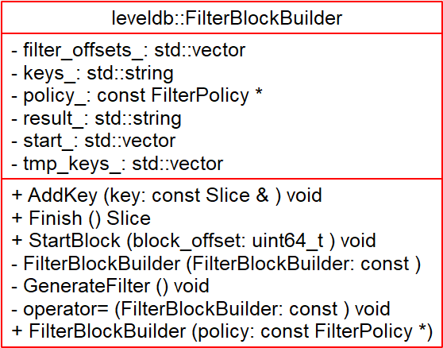
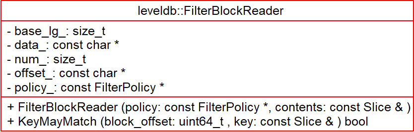

# FilterBlock - 2018-10-03 rsy

- [模块信息](#module_info)
- [模块概要](#module_in_brief)
- [模块功能](#module_function)
- [接口说明](#interface_specification)
- [相关依赖说明](#dependency_specification)
- [内部实现细节](#inner_detail)
- [参考资料](#reference)

&nbsp;   

## 模块信息

`table/filter_block.h`, `table/filter_block.cc`

&nbsp;   

## 模块概要

**`filter block` 就是 `meta block`，一般只有一个。**   
`filter block` 存储的是 `data block` 数据的一些过滤信息，用于加快查询的速度。   
一个 sstable 只有一个 `filter block`，其内存储了所有 `block` 的 filter 数据。

>索引和BloomFilter等元数据可随文件一起创建和销毁，即直接存在文件里，不用加载时动态计算，不用维护更新

把要输出的结果按照想要的格式整理好，在内存中放置好。之后由 `log_writer` 写入文件。

&nbsp;   

## 模块功能

&nbsp;   

## 接口说明

**`FilterBlockBuilder`**：

- `StartBlock()`：不懂这个什么意思，如果 `block_size` 给的过大，那么会一直向 `filter_offsets_` 中添加同样的 offset，即不创建新的 `filter block`
- `AddKey()`：加入key
- `Finish()`：把数据拼起来返回

**`FilterBlockReader`**：

- `KeyMayMatch()`：同 `filter`，若返回 false，则一定不存在

&nbsp;   

## 相关依赖说明

把要输出的结果按照想要的格式整理好，在内存中放置好。之后由 `log_writer` 写入文件。

`FilterReader::KeyMayMatch()` 在 `Table::InternalGet()` 中调用，直接跳过没有 key match 的 block（因为 filter 返回 false 表示一定不存在）。

&nbsp;   

## 内部实现细节

**图上的 `filter_policy` 其实是 `filter_block`。**   

先看 `FilterBlockBuilder::Finish()`，再看 `FilterBlockBuilder::GenerateFilter()` 就懂了。   
`FilterBlockBuilder::GenerateFilter()` 就是把当前的所有 key 变成一个新的 `filter block` 然后 append 到 `result_`，然后维护一下 offset，并清楚这些 key。

&nbsp;   
**`FilterReader`**：   

- `KeyMayMatch()`：根据 `block_offset_` 去 `offset_array` 找这个 `filter block` 在数据中的偏移量，然后调用 `filter`。

&nbsp;   

## 参考资料

- [LevelDB源码解析19. FilterBlockBuilder](https://zhuanlan.zhihu.com/p/45340857)
- [LevelDB源码分析](https://wenku.baidu.com/view/b3285278b90d6c85ec3ac687.html)
- [leveldb - FilterBlockBuilder](https://dirtysalt.github.io/html/leveldb.html#orgcda0a99)
- [leveldb - FilterBlockReader](https://dirtysalt.github.io/html/leveldb.html#orgcae4101)
- [leveldb-handlebook filterblock](https://leveldb-handbook.readthedocs.io/zh/latest/sstable.html#filter-block)