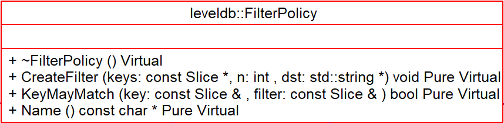
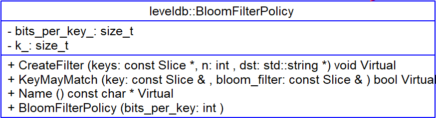

# FilterPolicy - 2018-10-03 rsy

- [模块信息](#module_info)
- [模块概要](#module_in_brief)
- [模块功能](#module_function)
- [接口说明](#interface_specification)
- [相关依赖说明](#dependency_specification)
- [参考资料](#reference)

&nbsp;   

## 模块信息

`include/leveldb/filter_policy.h`

&nbsp;   

## 模块概要

**上层用于查找 key，跳过一定没有出现 key 的 sstable**

&nbsp;   

## 模块功能

   

&nbsp;   

## 接口说明

- `CreateFilter()`：接受一组排序的 key，生成一个过滤器（append 到 `dst`）
- `KeyMayMatch()`：如果 key 在传递函数 `CreateFilter()` 的 key 列表中，则必须返回 true；注意，它不需要精确，也就是即使 key 不在前面传递的 key 列表中，也可以返回 true

- `NewBloomFilterPolicy()`：工厂函数，返回一个默认的布隆过滤器

&nbsp;   

## 相关依赖说明

默认实现是 [BloomFilter]()

&nbsp;   

## 参考资料

- [LevelDB源码分析](https://wenku.baidu.com/view/b3285278b90d6c85ec3ac687.html)
- [leveldb - filter_policy](https://dirtysalt.github.io/html/leveldb.html#org88fac7d)