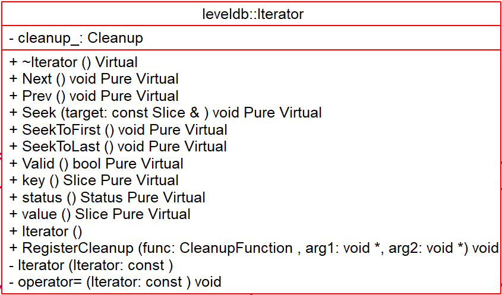

# Iterator - 2018-10-01 rsy

- [模块信息](#module_info)
- [模块概要](#module_in_brief)
- [模块功能](#module_function)
- [接口说明](#interface_specification)
- [内部实现细节](#inner_detail)
- [参考资料](#reference)

&nbsp;   

## 模块信息

`include/leveldb/iterator.h`, `table/iterator.cc`

&nbsp;   

## 模块概要

leveldb 中对 key 的查找和遍历，上层统一使用 `Iterator` 的方式处理，屏蔽底层的处理，统一逻辑。 提供 `RegisterCleanup()` 可以在 `Iterator` 销毁时，做一些清理工作（比如释放 `Iterator` 持有句柄的引用）

&nbsp;   

## 模块功能

leveldb 中 key 的查找遍历， 存储层面之上统一通过 Iterator 的方式处理。

存储结构（memtable/sstable/block） 都提供对应的 Iterator，另外还有为操作方便封装的特殊 Iterator。

- [`MemTableIterator`]() (`db/memtable.cc`)：memtable 对 key 的查找和遍历封装成 `MemTableIterator`。 底层直接使用 SkipList 的类  Iterator 接口
- [`TwoLevelIterator`]() (`table/two_level_iterator.cc`)：SSTable 对于类似 index ==> data 这种需要定位 index，然后根据 index 定位到具体 data 的使用方式
- [`Block::Iter`]() (`table/block.cc`)：上层对 Block 进行 key 的查找和遍历，封装成 `Block::Iter` 处理
- [`LevelFileNumIterator`]() (非 level-0 的 sstable 元信息集合的 Iterator) (`db/version_set.cc`)：level-0 中的 sstable 可能存在 overlap，处理时每个 sstable 单独处理即可
- [`IteratorWrapper`]() (`table/iterator_wrapper.h`)：提供了稍作优化的 Iterator 包装， 它会保存每次 `Key() / Valid()`的值， 从而避免每次调用 Iterator 接口产生的 virtural function 调用。另外，若频繁调用时，直接使用
保存的值，比每次计算能有更好的 cpu cache locality
- [`MergingIterator`]() (`table/merge.cc`)：`MergingIterator` 内部包含多个 Iterator 的集合，(`children_`)，每个操作，对 `children_` 中每个 Iterator 做同样操作之后按逻辑取边界的值即可
- [`DBIter`]() (`db/db_iter.cc`)：对 db 遍历

&nbsp;   

## 接口说明

- 前向遍历
- 后向遍历
- 查找
- 注册 `cleanup`

&nbsp;   

## 内部实现细节

`cleanup_` 组成一个链表，里面是回调函数，用于析构时释放资源。   
>搞不懂这块是谁写的，链表的加入方式是：   
>第一个就是头，之后来的倒序放置。

还提供了一个 `EmptyIterator`，用于在某些情况下边界值为0时的返回。

&nbsp;   

## 参考资料

- [leveldb实现解析 - 淘宝-核心系统研发-存储](https://github.com/rsy56640/read_and_analyse_levelDB/blob/master/reference/DB%20leveldb%E5%AE%9E%E7%8E%B0%E8%A7%A3%E6%9E%90.pdf)
- [LevelDB源码解析22. Iterator的设计](https://zhuanlan.zhihu.com/p/45602134)
- [leveldb](https://dirtysalt.github.io/html/leveldb.html#orgfa1dda5)
- [LevelDB源码分析--使用Iterator简化代码设计](https://www.cnblogs.com/KevinT/p/3823240.html)