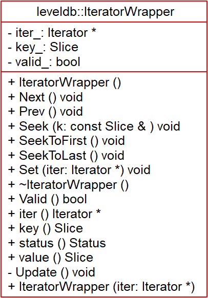

# IteratorWrapper - 2018-10-03 rsy

- [模块信息](#module_info)
- [模块概要](#module_in_brief)
- [模块功能](#module_function)
- [相关依赖说明](#dependency_specification)
- [参考资料](#reference)

&nbsp;   

## 模块信息

`table/iterator_wrapper.h`

&nbsp;   

## 模块概要

对于 Valid, Key 进行了缓存，管理 `Iterator` 对象的管理。

&nbsp;   

## 模块功能

&nbsp;   

## 参考资料

- [leveldb IteratorWrapper](https://dirtysalt.github.io/html/leveldb.html#org4289be2)