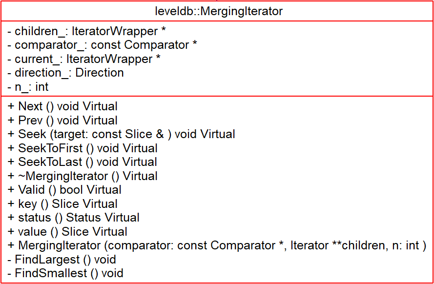

# MergingIterator - 2018-10-05 rsy

- [模块信息](#module_info)
- [模块概要](#module_in_brief)
- [模块功能](#module_function)
- [接口说明](#interface_specification)
- [相关依赖说明](#dependency_specification)
- [内部实现细节](#inner_detail)
- [参考资料](#reference)

&nbsp;   

## 模块信息

`table/merge.h`, `table/merge.cc`

&nbsp;   

## 模块概要

长得像 `TwoLevelIterator`，但是没有上层的管理，于是相当于是 **多路 Iterator 归并称为一个 Iterator 进行遍历**，用于 `DBImpl::NewInternalIterator()` 中收集所有 iterator（memtable, imm memtable, sstable）然后统一处理。

迭代器的遍历过程就是不断寻找所有子容器当前迭代器所指向的 key 最小的迭代器的过程。

&nbsp;   

## 模块功能

&nbsp;   

## 接口说明

工厂接口 `Iterator* NewMergingIterator()`：接受 n 个 iterator，返回一个 iterator 用于遍历。

&nbsp;   

## 相关依赖说明

函数 `DBImpl::NewInternalIterator()` 有一些处理逻辑，就是收集所有能用到的 iterator，生产一个`MergingIterator`。这包括 MemTable，Immutable MemTable，以及各 sstable。

&nbsp;   

## 内部实现细节

`MergingIterator` 直接托管了资源。

- `MergingIterator::Seek()`：每个 iterator 都 seek，然后调用 `FindSmallest()`
- `MergingIterator::Next()`：`current_` 前进一步，然后调用 `FindSmallest()`
- `MergingIterator::Prev()`：同上
- `MergingIterator::FindSmallest()`：设置 `current_` 为当前所有 iterator 中值最小的那个
- `MergingIterator::FindLargest()`：同上

&nbsp;   

## 参考资料

- [LevelDB源码分析](https://wenku.baidu.com/view/b3285278b90d6c85ec3ac687.html)
- [leveldb实现解析 - 淘宝-核心系统研发-存储](https://github.com/rsy56640/read_and_analyse_levelDB/blob/master/reference/DB%20leveldb%E5%AE%9E%E7%8E%B0%E8%A7%A3%E6%9E%90.pdf)
- [leveldb MergingIterator](https://dirtysalt.github.io/html/leveldb.html#orgb23a3d9)
- [LevelDB源码解析23. Merge Iterator](https://zhuanlan.zhihu.com/p/45661955)
- [leveldb源码剖析---迭代器设计](https://blog.csdn.net/Swartz2015/article/details/71404211)