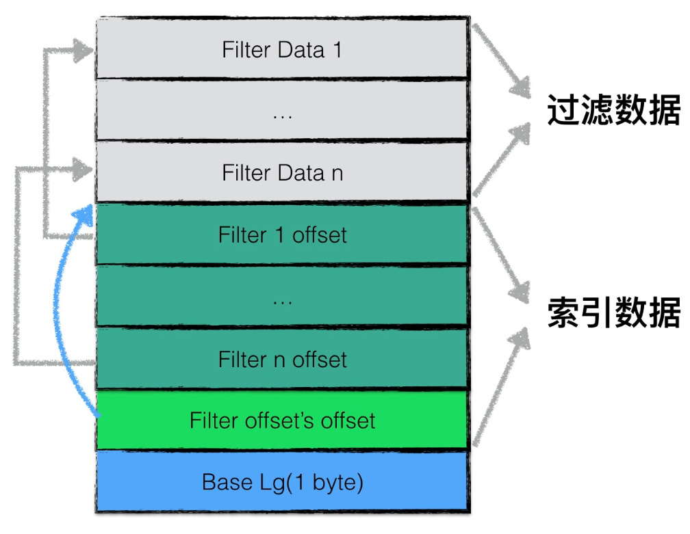
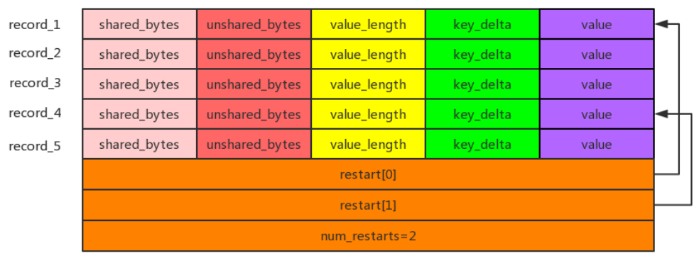
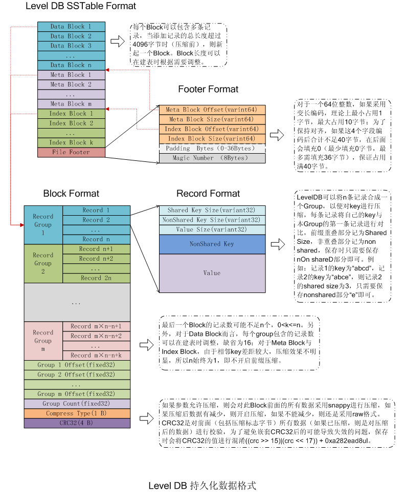
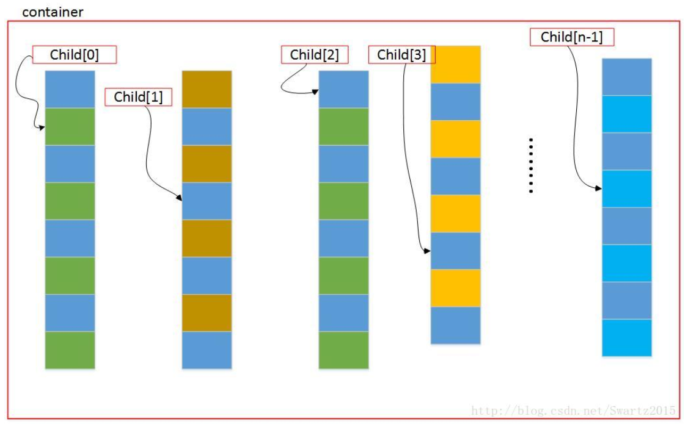

- [FilterBlock](#FilterBlock)
- [Block](#Block)
- [Table](#Table)
- [MergingIterator](#MergingIterator)
- 
- 

&nbsp;   

## [FilterBlock](https://github.com/rsy56640/read_and_analyse_levelDB/blob/master/architecture/SSTable/FilterBlock%20-%202018-10-03%20-%20rsy.md)

`filter block` 就是 `meta block`

&nbsp;   

## [Block](https://github.com/rsy56640/read_and_analyse_levelDB/blob/master/architecture/SSTable/Block%20-%202018-10-02%20-%20rsy.md)

&nbsp;   

## [Table](https://github.com/rsy56640/read_and_analyse_levelDB/blob/master/architecture/SSTable/Table%20-%202018-10-04%20-%20rsy.md)

- **Data Block** 内的 KV 记录是按照 Key 由小到大排列的
- **Index Block** 的每条记录是对某个Data Block建立的索引信息，每条索引信息包含三个内容：
  - Data Block 中 key 上限值(不一定是最大key)
  - Data Block 在 .sst 文件的偏移和大小

>（转）data index block 组织形式和 data block 非常类似，只不过有两个不同。1) data index block 从不刷新直到 Table 构造完成之后才会刷新，所以 对于一个 table 而言的话只有一个 data index block。2) data index block 添加的 k-v 是在 data block 形成的时候添加的，添加 key 非常取巧 ，是上一个data block和这个 data block 的一个 key seperator。比如上一个 data block 的 max key 是 "abcd"，而这个 data block 的 min key 是 "ad"。那么这个 seperator 可以设置成为 "ac"。seperator 的生成可以参考 Comparator。使用尽量短的 seperator 可以减小磁盘开销并且提高效率。而对于添加的 value 就是这个 data block 的 offset.同样在 data index block 也会存在 restart point。   
>然后看看进行一个 key 的 query 是如何进行的。首先读取出 data index block（这个部分可以常驻内存），得到里面的 restart point 部分。针对 restart point 进行二分。因为 restart point 指向的 key 都是全量的 key。如果确定在某两个 restart point 之间之后，就可以遍历这个 restart point 之间范围分析 seperator。得到想要查找的 seperator 之后对应的 value 就是某个 data block offset。读取这个 data block 和之前的方法一样就可以查找 key 了。对于遍历来说，过程是一样的。   
>这里我们稍微分析一下这样的工作方式的优缺点。对于写或者是 merge 来说的话，效率相当的高，所有写都是顺序写并且还可以进行压缩。影响写效率的话一个重要参数就是 flush block 的参数。 但是对于读来说的话，个人觉得过程有点麻烦，但是可以实现得高效率。对于 flush block 调节会影响到 data index block 和 data block 占用内存大小。如果 flush block 过大的话， 那么会造成 data index block 耗费内存小，但是每次读取出一个 data block 内存很大。如果 flush block 过小的话，那么 data index block 耗费内存很大，但是每次读取 data block 内存很小。 而 restart point 数量会影响过多的话，那么可能会占用稍微大一些的内存空间，但是会使得查找过程更快（遍历数更少）。   

&nbsp;   

## [MergingIterator](https://github.com/rsy56640/read_and_analyse_levelDB/blob/master/architecture/SSTable/MergingIterator%20-%202018-10-05%20-%20rsy.md)

多路 Iterator 归并称为一个 Iterator 进行遍历，迭代器的遍历过程就是不断寻找所有子容器当前迭代器所指向的 key 最小的迭代器的过程。

用于 `DBImpl::NewInternalIterator()` 中收集所有 iterator（memtable, imm memtable, sstable）然后统一处理。

&nbsp;   

## 

