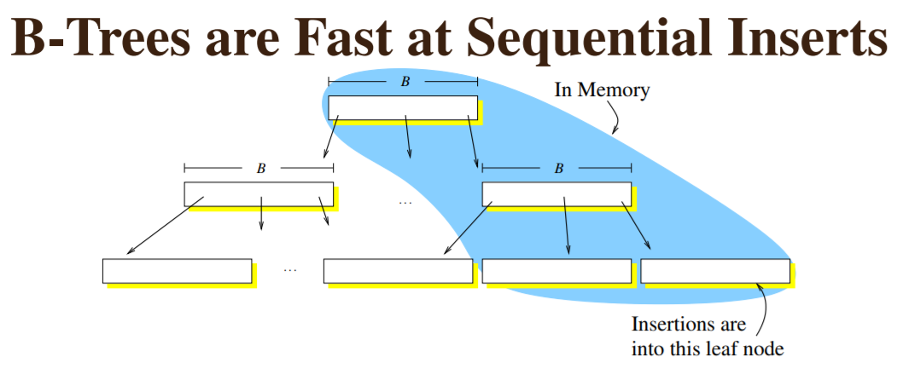
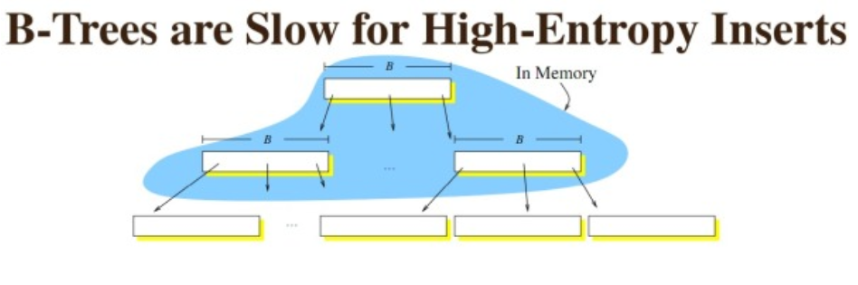
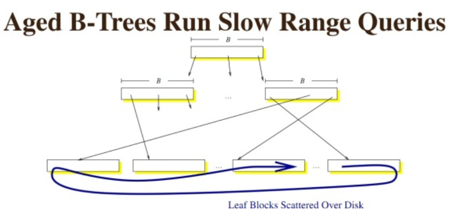

- [FilterBlock](#FilterBlock)
- [Block](#Block)
- [Table](#Table)
- [MergingIterator](#MergingIterator)
- [TwoLevelIterator](#TwoLevelIterator)
- [Filter(meta) Block](#filter_block)
- [Compaction](#Compaction)
- [LSM](#LSM)

&nbsp;   

## [FilterBlock](https://github.com/rsy56640/read_and_analyse_levelDB/blob/master/architecture/SSTable/FilterBlock%20-%202018-10-03%20-%20rsy.md)

`filter block` 就是 `meta block`

&nbsp;   

## [Block](https://github.com/rsy56640/read_and_analyse_levelDB/blob/master/architecture/SSTable/Block%20-%202018-10-02%20-%20rsy.md)

&nbsp;   

## [Table](https://github.com/rsy56640/read_and_analyse_levelDB/blob/master/architecture/SSTable/Table%20-%202018-10-04%20-%20rsy.md)

- **Data Block** 内的 KV 记录是按照 Key 由小到大排列的
- **Index Block** 的每条记录是对某个Data Block建立的索引信息，每条索引信息包含三个内容：
  - Data Block 中 key 上限值(不一定是最大key)
  - Data Block 在 .sst 文件的偏移和大小

>（转）data index block 组织形式和 data block 非常类似，只不过有两个不同。1) data index block 从不刷新直到 Table 构造完成之后才会刷新，所以 对于一个 table 而言的话只有一个 data index block。2) data index block 添加的 k-v 是在 data block 形成的时候添加的，添加 key 非常取巧 ，是上一个data block和这个 data block 的一个 key seperator。比如上一个 data block 的 max key 是 "abcd"，而这个 data block 的 min key 是 "ad"。那么这个 seperator 可以设置成为 "ac"。seperator 的生成可以参考 Comparator。使用尽量短的 seperator 可以减小磁盘开销并且提高效率。而对于添加的 value 就是这个 data block 的 offset.同样在 data index block 也会存在 restart point。   
>然后看看进行一个 key 的 query 是如何进行的。首先读取出 data index block（这个部分可以常驻内存），得到里面的 restart point 部分。针对 restart point 进行二分。因为 restart point 指向的 key 都是全量的 key。如果确定在某两个 restart point 之间之后，就可以遍历这个 restart point 之间范围分析 seperator。得到想要查找的 seperator 之后对应的 value 就是某个 data block offset。读取这个 data block 和之前的方法一样就可以查找 key 了。对于遍历来说，过程是一样的。   
>这里我们稍微分析一下这样的工作方式的优缺点。对于写或者是 merge 来说的话，效率相当的高，所有写都是顺序写并且还可以进行压缩。影响写效率的话一个重要参数就是 flush block 的参数。 但是对于读来说的话，个人觉得过程有点麻烦，但是可以实现得高效率。对于 flush block 调节会影响到 data index block 和 data block 占用内存大小。如果 flush block 过大的话， 那么会造成 data index block 耗费内存小，但是每次读取出一个 data block 内存很大。如果 flush block 过小的话，那么 data index block 耗费内存很大，但是每次读取 data block 内存很小。 而 restart point 数量会影响过多的话，那么可能会占用稍微大一些的内存空间，但是会使得查找过程更快（遍历数更少）。   

&nbsp;   

## [MergingIterator](https://github.com/rsy56640/read_and_analyse_levelDB/blob/master/architecture/SSTable/MergingIterator%20-%202018-10-05%20-%20rsy.md)

多路 Iterator 归并称为一个 Iterator 进行遍历，迭代器的遍历过程就是不断寻找所有子容器当前迭代器所指向的 key 最小的迭代器的过程。

用于 `DBImpl::NewInternalIterator()` 中收集所有 iterator（memtable, imm memtable, sstable）然后统一处理。

&nbsp;   

## [TwoLevelIterator](https://github.com/rsy56640/read_and_analyse_levelDB/blob/master/architecture/SSTable/TwoLevelIterator%20-%202018-10-03%20-%20rsy.md)

将对 Table 的遍历封装，对外展现如同线性遍历。

&nbsp;   

## [Filter(meta) Block](https://github.com/rsy56640/read_and_analyse_levelDB/blob/master/architecture/SSTable/FilterBlock%20-%202018-10-03%20-%20rsy.md)

**`filter block` 就是 `meta block`。**    
`filter block` 存储的是 `data block` 数据的一些过滤信息，用于加快查询的速度。

&nbsp;   

## [Compaction](https://github.com/rsy56640/read_and_analyse_levelDB/blob/master/architecture/SSTable/Compaction%20-%202018-10-05%20-%20rsy.md)

- LevelDB 存储分为两部分，一部分在内存，另一部分在磁盘上。内存中方便快速查找， 查找失败后，去磁盘上查找。一段时间后或内存达到一定大小，会将内存中的 compact 成 .sst 文件存在磁盘
- compaction 是执行 LSM-tree 中 merge 的过程
- 删除操作在 memtable 只是打上删除标记，**真正的删除** 在 compaction 中做
- **minor compaction** 用于内存到外存的迁移过程。level-0 是将 memTable 整个 dump 出来的结果，因此可能之间有相交，这个操作叫 minor compaction
- **major compaction** 用于 level 之间的迁移。major compaction 是将 层i 合到 层i+1 中去，合并是将 层i 中的一块合到整个 层i+1 中去， 这个过程类似归并排序，将参与的几个块全部取出来排序，再重新组合成新的 层i+1，同时 会将重复的 key 弃掉（弃掉是指如果 key 已经出现在更低的层，则高级的层不需要记录这个 key）
  - 对 level > 0 的 sstables，选择其中一个 sstable 与 下一层 sstables 做合并
  - 对 level-0 的 sstables，在选择一个 sstable 后，还需要找出所有与这个 sstable 有 key 范围重叠的 sstables，最后统统与 level-1 的 sstables 做合并

### Minor Compation

 

### Major Compaction

&nbsp;   

## [LSM]()

B树在插入的时候，如果是最后一个node,那么速度非常快，因为是顺序写。

但如果有更新插入删除等综合写入，最后因为需要循环利用磁盘块，所以会出现较多的随机I/O。大量时间消耗在磁盘寻道时间上。

将 随机写 改为 顺序写，大大提高了 I/O 速度。   
核心思想是：

- 对变更进行批量 & 延时处理
- 通过归并排序将更新迁移到硬盘上

文件是不可修改的，他们永远不会被更新，新的更新操作只会写到新的文件中。通过周期性的合并这些文件来减少文件个数。   

但是读操作会变的越来越慢随着 sstable 的个数增加，因为每一个 sstable 都要被检查。最基本的的方法就是页缓存（也就是 leveldb 的 TableCache，将 sstable 按照 LRU 缓存在内存中）在内存中，减少二分查找的消耗。即使有每个文件的索引，随着文件个数增多，读操作仍然很慢。通过周期的合并文件，来保持文件的个数，因些读操作的性能在可接收的范围内。即便有了合 并操作，读操作仍然会访问大量的文件，大部分的实现通过布隆过滤器来避免大量的读文件操作，布隆过滤器是一种高效的方法来判断一个 sstable 中是否包 含一个特定的 key。

我们交换了读和写的随机 I/O。这种折衷很有意义，我们可以通过软件实现的技巧像布隆过滤器或者硬件（大文件 cache）来优化读性能。

&nbsp;   

## 

