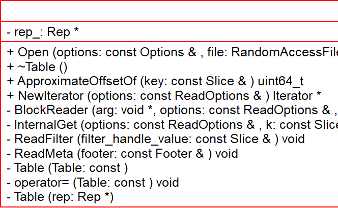
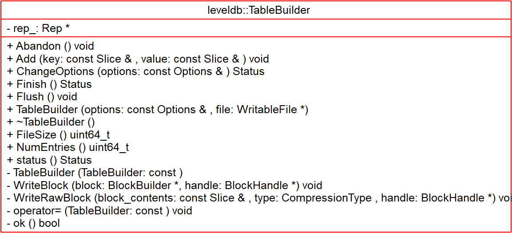

# Table - 2018-10-02 rsy

- [模块信息](#module_info)
- [模块概要](#module_in_brief)
- [模块功能](#module_function)
- [接口说明](#interface_specification)
- [内部实现细节](#inner_detail)
- [参考资料](#reference)

&nbsp;   

## 模块信息

`include/leveldb/table.h`, `table/table.cc`, `table/table_builder.cc`, `include/leveldb/table_builder.h`

`SSTable` 文件格式：   

- **Data Block** 内的 KV 记录是按照 Key 由小到大排列的
- **Index Block** 的每条记录是对某个Data Block建立的索引信息，每条索引信息包含三个内容：
  - Data Block 中 key 上限值(不一定是最大key)
  - Data Block 在 .sst 文件的偏移和大小

&nbsp;   

## 模块概要

&nbsp;   

## 模块功能

- `Table` 类主要完成 sstable 的读取逻辑
- `TableBuilder` 类用于构建 sstable，将 `data block`, `filter block`, `meta index block`,  `index block`, `footer` 写入文件

&nbsp;   

## 接口说明

**`Table`**：

- `Table::Open()`：反序列化文件数据，`footer`, `index_block`，之后 `ReadMeta()`, `ReadFilter()`
- `Table::NewIterator()`：返回一个 `TwoLevelIterator`

**`TableBuilder`**：

- `TableBuilder::Add()`：向当前 sstable 添加 k-v，要求添加 key 的顺序必须是递增的
- `TableBuilder::Flush()`：将当前缓存的 k-v 全部 flush 到文件中
- `TableBuilder::Abandon()`：结束表的构建，并丢弃当前缓存的内容，该方法被调用后，将不再会使用传入的 `WritableFile`
- `TableBuilder::Finish()`：结束表的构建，该方法被调用后，将不再会使用传入的 `WritableFile`

一旦 `Finish()/Abandon()` 方法被调用，将不能再次执行 `Flush()` 或者 `Add()` 操作。

&nbsp;   

## 内部实现细节

- `Table::BlockReader()`：解析出一个 `Block`，然后维护一下 `Cache`
- `Table::InternalGet()`：调用 `db/version_set.cc` 中的 `SaveValue`，如果 key match 了，就把 `value` 存下来
- `TableBuilder::Finish()`：
  - 首先调用 `Flush()`，写完最后的 block
  - 然后依次写 `meta block(filter block)`, `index block`, `footer`
- `TableBuilder::WriteBlock()`：在 Flush 文件时，会调用 `WriteBlock()` 函数将 data block 写入到文件中，该函数同时还设置 data block 的 index entry 信息。该函数做些预处理工作，序列化要写入的 data block，根据需要压缩数据，真正的写入逻辑是在 `WriteRawBlock()` 函数中
- `TableBuilder::WriteRawBlock()`：把一个 block 和 结尾的 5B 写入文件，并维护 `rep_` 的 size 和 offset

&nbsp;    
&nbsp;    
`TableBuilder::Add()`：看了好一会才懂，数据的序列化和反序列化这个地方太硬核了，好多地方我都记不住，根本想不起来哪些地方存的啥东西。。。

>（转1）直到遇到下一个 databock 的第一个 key 时，我们才为上一个 datablock 生成 index entry，这样的好处是：可以为 index 使用较短的 key；比如上一个 data block 最后一个 k/v 的 key 是"the quick brown fox"，其后继 data block 的第一个 key 是 "the who"，我们就可以用一个较短的字符串 "the r" 作为上一个 data block 的 index block entry 的 key。

>（转2）data index block 组织形式和 data block 非常类似，只不过有两个不同。1)data index block从不刷新直到Table构造完成之后才会刷新，所以 对于一个table而言的话只有一个data index block. 2)data index block 添加的 key/value 是在 data block 形成的时候添加的，添加 key 非常取巧 ，是上一个data block和这个 data block 的一个 key seperator。比如上一个 data block 的 max key 是 "abcd"，而这个 data block 的min key是 "ad"。那么这个 seperator 可以设置成为 "ac"。seperator 的生成可以参考 Comparator。使用尽量短的 seperator 可以减小磁盘开销并且提高效率。而对于添加的 value 就是这个 data block 的 offset.同样在 data index block 也会存在 restart point。   
>然后看看进行一个key的query是如何进行的。首先读取出 data index block(这个部分可以常驻内存)，得到里面的restart point部分。针对 restart point 进行二分。因为restart point指向的key都是全量的key.如果确定在某两个restart point之间之后，就可以遍历这个restart point之间范围分析seperator. 得到想要查找的seperator之后对应的value就是某个data block offset.读取这个data block和之前的方法一样就可以查找key了。对于遍历来说，过程是一样的。   
>这里我们稍微分析一下这样的工作方式的优缺点。对于写或者是merge来说的话，效率相当的高，所有写都是顺序写并且还可以进行压缩。影响写效率的话一个重要参数就是flush block的参数。 但是对于读来说的话，个人觉得过程有点麻烦，但是可以实现得高效率。对于flush block调节会影响到data index block和data block占用内存大小。如果flush block过大的话， 那么会造成data index block耗费内存小，但是每次读取出一个data block内存很大。如果flush block过小的话，那么data index block耗费内存很大，但是每次读取data block内存很小。 而restart point数量会影响过多的话，那么可能会占用稍微大一些的内存空间，但是会使得查找过程更快(遍历数更少)。   

&nbsp;   

## 参考资料

- [leveldb实现解析 - 淘宝-核心系统研发-存储](https://github.com/rsy56640/read_and_analyse_levelDB/blob/master/reference/DB%20leveldb%E5%AE%9E%E7%8E%B0%E8%A7%A3%E6%9E%90.pdf)
- [leveldb-handlbook sstable](https://leveldb-handbook.readthedocs.io/zh/latest/sstable.html)
- [levelDB SSTable-静态布局结构](https://www.cnblogs.com/shenzhaohai1989/p/3907373.html)
- [LevelDB源码分析](https://wenku.baidu.com/view/b3285278b90d6c85ec3ac687.html)
- [leveldb - Table](https://dirtysalt.github.io/html/leveldb.html#orgb0dff4a)
- [LevelDB 5.SSTable](https://www.cnblogs.com/ym65536/p/7751229.html)
- [LevelDB源码解析16.SST文件格式](https://zhuanlan.zhihu.com/p/44954881)
- [LevelDB源码解析24. SST文件生成器](https://zhuanlan.zhihu.com/p/45693221)
- [LevelDB源码解析25. SST文件内存表示](https://zhuanlan.zhihu.com/p/45730480)
- [leveldb源码分析之写sst文件](http://luodw.cc/2015/10/21/leveldb-10/)
- [leveldb源码分析之读sst文件](http://luodw.cc/2015/10/24/leveldb-12/)
- [SSTable之文件格式及生成-leveldb源码剖析(7)](http://www.pandademo.com/2016/04/sstable-file-format-and-build-leveldb-source-dissect-7/)
- [leveldb - sstable格式](https://www.cnblogs.com/cobbliu/p/6194072.html)
- [leveldb源码分析--SSTable之TableBuilder](https://www.cnblogs.com/KevinT/p/3816746.html)