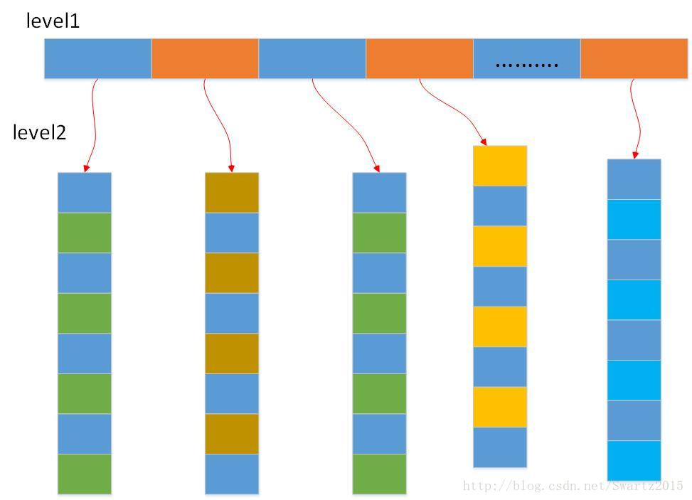
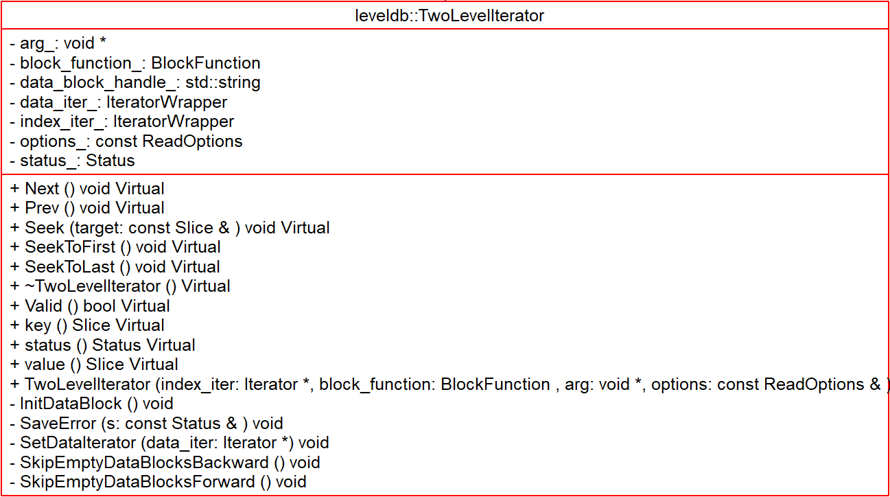

# TwoLevelIterator - 2018-10-03 rsy

- [模块信息](#module_info)
- [模块概要](#module_in_brief)
- [模块功能](#module_function)
- [接口说明](#interface_specification)
- [相关依赖说明](#dependency_specification)
- [内部实现细节](#inner_detail)
- [参考资料](#reference)

&nbsp;   

## 模块信息

`table/two_level_iterator.h`, `table/two_level_iterator.cc`

&nbsp;   

## 模块概要

将对 `Table` 的遍历封装，对外展现如同线性遍历。

&nbsp;   

## 模块功能

&nbsp;   

## 接口说明

工厂函数：   `Iterator* NewTwoLevelIterator()`

&nbsp;   

## 相关依赖说明

两层迭代器都是 `IteratorWrapper` 类型而不是 iter，主要是为了缓存 key 和 valid。

`DBImpl::NewIterator()` -> `DBImpl::NewInternalIterator()` -> `Version::AddIterators()` -> `TableCache::NewIterator()` -> `Table::NewIterator()` -> `NewTwoLevelIterator()`

&nbsp;   

## 内部实现细节

`BlockFunction` 用于在遍历不同的 block 时，解析不同的 k-v。

- `SkipEmptyDataBlocksForward()` 封装了 “如果应该到下一个 block，就进入下一个 block 的第一个”，把其他函数从 “边界处理” 上解放出来。
- `SkipEmptyDataBlocksBackward()` 同上

&nbsp;   

## 参考资料

- [LevelDB源码分析](https://wenku.baidu.com/view/b3285278b90d6c85ec3ac687.html)
- [leveldb实现解析 - 淘宝-核心系统研发-存储](https://github.com/rsy56640/read_and_analyse_levelDB/blob/master/reference/DB%20leveldb%E5%AE%9E%E7%8E%B0%E8%A7%A3%E6%9E%90.pdf)
- [LevelDB源码解析26. 二级迭代器](https://zhuanlan.zhihu.com/p/45829937)
- [LevelDB源码分析之十四：TwoLevelIterator](https://blog.csdn.net/caoshangpa/article/details/79046942)
- [leveldb TwoLevelIterator](https://dirtysalt.github.io/html/leveldb.html#org46fb0c0)
- [LevelDB源码分析--使用Iterator简化代码设计](https://www.cnblogs.com/KevinT/p/3823240.html)