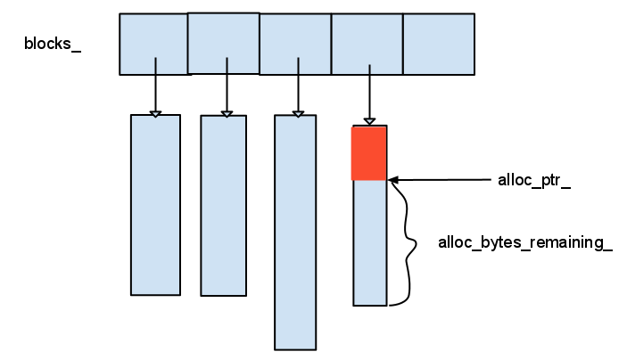

# arena - 2018-09-27 rsy

- [模块信息](#module_info)
- [模块概要](#module_in_brief)
- [模块功能](#module_function)
- [接口说明](#interface_specification)
- [相关依赖说明](#dependency_specification)
- [内部实现细节](#inner_detail)
- [参考资料](#reference)

&nbsp;   

## 模块信息

`util/arena.h`, `util/arena.cc`

&nbsp;   

## 模块概要

用于分配空间，不含有GC & RC.

leveldb实现了定制的Arena内存分配器，并没有直接使用glibc的malloc或者c++标准库的new。

Arena 主要与 MemTable 关联使用，实际主要用于 SkipList 中的 Node 内存分配，统一 MemTable 的内存分配需求，减少内存分配的实际系统调用次数（尤其针对小块内存），减少内存分配中的空洞（碎片），但也会造成一定的内存浪费；统一内存释放，不必频繁 new/delete；鉴于 Arena 在 leveldb 中的使用场景不需考虑线程安全。Arena 的实现简单轻量，代码总计百余行，服务于 leveldb 的定制需求，提高应用性能，并且提供了内存对齐的版本。

&nbsp;   

## 模块功能

&nbsp;   

## 接口说明

分配所需大小的（对齐）空间。

&nbsp;   

## 相关依赖说明

被 `memtable` private 含有，用于在 `memtable` 中分配空间，在 `memtable` 析构时 `arena` 析构。

&nbsp;   

## 内部实现细节

如果要申请的空间小于当前这一条的剩余，那么ok。否则：1. 若申请空间大于 1M，单独开一个申请大小的条；2. 开一个4M的条，并维护当前指针和剩余空间大小。   
没有 GC 和 RC，在析构时（在 `memtable` 中析构）统一全部释放。

&nbsp;   

## 参考资料

- [和我一起学习leveldb 7 util(续)](http://brg-liuwei.github.io/tech/2014/11/17/leveldb-7.html)
- [Arena内存管理-leveldb源码剖析(1)](http://www.pandademo.com/2016/03/arena-memory-management-leveldb-source-dissect-1/)
- [LevelDB源码剖析之Arena内存管理](http://mingxinglai.com/cn/2013/01/leveldb-arena/)
- [leveldb - Arena](https://dirtysalt.github.io/html/leveldb.html#orgfda6998)
- [leveldb源码分析之内存池Arena](http://luodw.cc/2015/10/15/leveldb-04/)
- [LevelDB源码分析](https://wenku.baidu.com/view/b3285278b90d6c85ec3ac687.html)