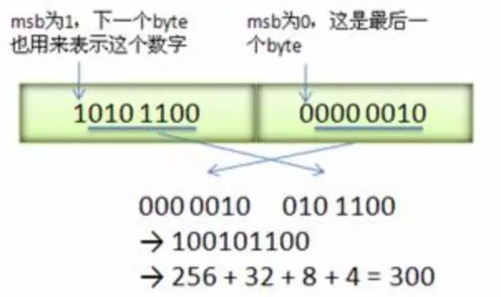

# coding - 2018-09-26 rsy

- [模块信息](#module_info)
- [模块功能](#module_function)
- [接口说明](#interface_specification)
- [内部实现细节](#inner_detail)
- [参考资料](#reference)

&nbsp;   

## 模块信息

`util/coding.h`, `util/coding.cc`    
Coding 主要是用来完成变长数据以及字符串还有Slice的序列化和反序列化的。
主要用途是用来 **省空间**。

&nbsp;   

## 模块功能

- PutFixed32 写入定长uint32
- PutFixed64 写入定长uint64
- PutVarint32 写入变长uint32
- PutVarint64 写入变长uint64
- PutLengthPrefixedSlice 后面解释.
- GetVarint32 读取变长uint32
- GetVarint64 读取变长uint64
- GetLengthPrefixedSlice 后面解释.
- GetVarint32Ptr(p,limit,v) 将[p,limit)部分的内存解析为变长uint32放到v里面,返回下一个字节
- GetVarint64Ptr(p,limit,v) 将[p,limit)部分的内存解析为变长uint64放到v里面,返回下一个字节
- VarintLength 变长uint32/uint64长度
- EncodeFixed32 PutFixed32 保证小端序
- EncodeFixed64 PutFixed64
- EncodeVarint32 PutVarint32
- EncodeVarint64 PutVarint64
- DecodeFixed32 读取定长uint32
- DecodeFixed64 读取定长uint64
- GetVarint32Ptr 从[p,limit)读取uint32并且返回下一个字节.

&nbsp;   

## 接口说明

使用 编解码 主要是因为 涉及到各种 key 是 Varint 类型。   
编解码均分为 fixed 和 var 两种。   

主要用于 压缩 int的存储空间，最终存为 string，然后用的时候再 decode。

&nbsp;   

## 内部实现细节

- 小端序 little-ending
- 每个 byte 只利用 **低7位**，**最高位存储是否还有后续的部分**。所以对于大数，有可能用 5个 bytes。（真是细节到爆炸。。。）
- `GetVarint32Ptr` 用于 Varint32 解码，该函数处理 只有1byte的情况，否则转发给 `GetVarint32PtrFallback`。在 `GetVarint32Ptr` 和 `GetVarint32PtrFallback` 函数中，参数 `p` 是指向一个包含 varint 的字符串，`limit` 在调用的时候都是赋值为 `limit = p + 5`, 这是因为 varint 最多占用5个字节。`value` 用于存储返回的int值。

&nbsp;   

## 参考资料

- [LevelDB源码剖析之Varint](http://mingxinglai.com/cn/2013/01/leveldb-varint32/)
- [leveldb - Coding](https://dirtysalt.github.io/html/leveldb.html#orgad70de3)
- [LevelDB源码分析](https://wenku.baidu.com/view/b3285278b90d6c85ec3ac687.html)