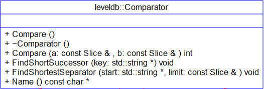
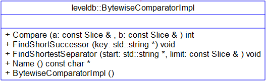
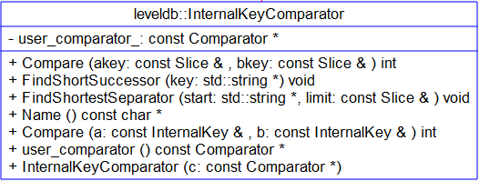

# Module - 2018-10-10 毛恺

- [模块信息](#module_info)
- [模块概要](#module_in_brief)
- [模块功能](#module_function)
- [接口说明](#interface_specification)
- [相关依赖说明](#dependency_specification)
- [内部实现细节](#inner_detail)
- [参考资料](#reference)

&nbsp;   

## 模块信息
Comparator(util/comparator.cc,include/leveldb/comparator.h，db/dbformat.h，db/dbformat.cc)

&nbsp;   

## 模块概要
Comparator:
leveldb是按Key序组织的,对于Key的比较非常重要。
Comparator的主要作用就是Key的比较，同时也会对key进行一定的优化，以降低一些存储空间。

BytewiseComparatorImpl&InternalKeyComparator:
在dbformat中实现的两种Comparator。

&nbsp;   

## 模块功能

在comparator.h中定义，主要函数有：
Compare 为实际使用的比较函数。
Name 获取comparator的名称，主要为了防止建立和读取时使用了不同的Comparator。
FindShortestSeparator 找出参数[start，limit)区间内间一个短的串，主要作用是降低一点储存空间。
FindShortestSuccessor 作用类似上一个函数。

在comparator.cc中实现。
其Compare函数直接调用Slice的Compare。

&nbsp;   

## 接口说明

&nbsp;   

## 相关依赖说明

&nbsp;   

## 内部实现细节

&nbsp;   

## 参考资料

