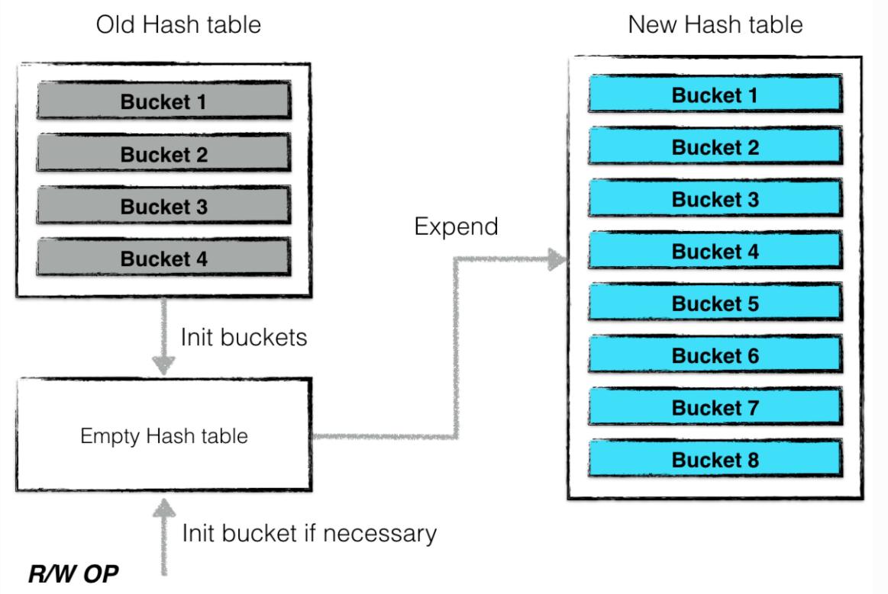

# Cache - 2018-09-20 - rsy

- [模块概要](#module_in_brief)
- [模块功能](#module_function)
- [接口说明](#interface_specification)
- [相关依赖说明](#dependency)
- [内部实现细节](#inner_detail)
- [参考资料](#reference)

## 模块概要
cache.h (include/leveldb/cache.h)   
cache.cc (util/cache.cc)

Cache主要是用来作为kv查询cache部分，主要用于 TableCache(db/tabe_cache.h) 中，

&nbsp;    

## 模块功能

Cache 功能：（保证线程安全）

- Insert // 插入kv返回Handle
- Lookup // 查询k返回Handle
- Value // 传入handle得到对应的value
- Erase // 删除kv
- NewId // 产生一个新id

`ShardedLRUCache`，所谓 Shard 意思非常简单，就是将所有的请求进行 load-balance。将 `LRUCache` 再做 shard 的目的是为了加速查找和减少冲突。   
整体来看，上层使用 cache 时，首先根据 key 做 shard，然后在 `LRUCache` 层对 `HashHandle` 做数据的操作，最后处理 lru 逻辑。

&nbsp;   
leveldb 利用上述的 cache 结构来缓存数据。其中：

- cache：来缓存已经被打开的 sstable 文件句柄以及元数据（默认上限为500个）
- bcache：来缓存被读过的 sstable 中 dataBlock 的数据（默认上限为8MB）

当一个 sstable 文件需要被打开时，首先从 cache 中寻找是否已经存在相关的文件句柄，若存在则无需重复打开；若不存在，则从打开相关文件，并将（1）indexBlock 数据，（2）metaIndexBlock 数据等相关元数据进行预读。

&nbsp;    

## 接口说明

对外接口主要是：   
创建工厂：

    Cache* NewLRUCache(size_t capacity) {
        return new ShardedLRUCache(capacity);
    }
需要用户手动 `delete`.   

操作接口：同 `Cache` 接口。

&nbsp;    

## 相关依赖说明

在 TableCache 中的作用：   

TableCache 用于缓存SSTable的对应索引元数据。   
TableCache的查找流程，用户提交key查询，交由 `Status DBImpl::Get(const ReadOptions& options, const Slice& key, std::string* value)` ，获取两种 `MemTable` 和当前 `Version`，依次查询 memtable、 immutable memtable，未找到则在当前 `Version `上 `Status Version::Get(const ReadOptions& options, const LookupKey& k, std::string* value, GetStats* stats)`，依次从 最低level 到 最高level 查询直至查到，在每层确定可能包含该 key 的 SSTable 文件后，就会在所属 `VersionSet` 的`table_cache` 中继续查询，即调用 `Status TableCache::Get(const ReadOptions& options, uint64_t file_number, uint64_t file_size, const Slice& k, void* arg, void (*handle_result)(void*, const Slice&, const Slice&))`

&nbsp;    

## 内部实现细节

内部有 `port::Mutex mutex_`(RAII)，保证线程安全。

&nbsp;   
关于 **Handle**：   

Handle是了为了管理cache item。Handle 为空结构体，是因为用于操作的其实是 `LRUHandle`，虽然没有继承，但是 Handle 为空，所以无所谓了。（因为继承空类会被优化掉）

可以看到有3个指针：

- `next_hash`：hash表中的下一个结点。（HandleTable使用链表实现，最后一个结点的next_hash是NULL）
- `next`，`prev`：在LRU双向链表中的数据结构。

所有的 cache 数据都是存储在一个双向 LRU-list 中。LRUHandle是 LRUCache 的管理对象，代表 Cache 里面的元素。LRUHandle一方面在LRU队列里面需要维护指针，一方面在hashtable(HandleTable下面会讲到)需要维护指针。同时存在于LRU队列和HashTable里面。

&nbsp;    
`LRUHandle` 中，`charge` 的作用是记录这条 cache entry 中的 `value` 所指的内存区域大小，cache 的内容有容量限制。   
`LRUHandle->refs` 表示引用计数。为 0 时，表示不在 cache 中；为 1 时，表示在 `lru_` 中；大于 1 时，在 `in_use_` 中，其值减一表示被 clients 引用的次数。   
`LRUHandle` 结构体最后定义了 `char key_data[1];`，此为C程序员惯用手法：[未知大小数组 - 柔性数组](https://zh.cppreference.com/w/c/language/array#.E6.9C.AA.E7.9F.A5.E5.A4.A7.E5.B0.8F.E6.95.B0.E7.BB.84)   
>在 struct 定义中，未知大小数组必须出现作最后一个元素（只要有一个具名成员），这种情况下，这是称为柔性数组成员的特殊情形。

&nbsp;    
**HandleTable 在 resize 时的 lock-free**：   

**下面这段和 leveldb 没关系，不过挺有意思的：网上看是这么说的：**   

-----
当cache中维护的数据量太大时，会发生哈希表扩张的情况。以下两种情况是为“cache中维护的数据量过大”：

- 整个cache中，数据项（node）的个数超过预定的阈值（默认初始状态下哈希桶的个数为16个，每个桶中可存储32个数据项，即总量的阈值为哈希桶个数乘以每个桶的容量上限）
- 当cache中出现了数据不平衡的情况。当某些桶的数据量超过了32个数据，即被视作数据发生散列不平衡。当这种不平衡累积值超过预定的阈值（128）个时，就需要进行扩张

一次扩张的过程为：   
1. 计算新哈希表的哈希桶个数（扩大一倍）   
2. 创建一个空的哈希表，并将旧的哈希表（主要为所有哈希桶构成的数组）转换一个“过渡期”的哈希表，表中的每个哈希桶都被“冻结”。   
3. 后台利用“过渡期”哈希表中的“被冻结”的哈希桶信息对新的哈希表进行内容构建。   
当有新的读写请求发生时，若被散列之后得到的哈希桶仍然未构建完成，则“主动”进行构建，并将构建后的哈希桶填入新的哈希表中。后台进程构建到该桶时，发现已经被构建了，则无需重复构建。   
因此如上图所示，哈希表扩张结束，哈希桶的个数增加了一倍，于此同时仍然可以对外提供读写服务，仅仅需要哈希桶级别的封锁粒度就可以保证所有操作的一致性跟原子性。

- 在完成新的哈希表构建的整个过程中，哈希表并不是拒绝服务的，所有的读写操作仍然可以进行。
- 哈希表扩张过程中，最小的封锁粒度为哈希桶级别。

-----

resize 真正的实现：

发生 resize 的时机：当元素个数超过 hash 长度时。   
原因是：因为每一个 cache entry 都比较大，所以尽量让每条链最多一个元素。
>// Since each cache entry is fairly large, we aim for a small   
>// average linked list length (<= 1).

转移：遍历原桶中的所有 handle，对 key 取模(`& (new_length - 1)`)，插到新的桶里。  
细节：

- `length` 永远保持 2 的幂次，这样取模的时候可以做位运算。
- 线程安全性：`HandleTable::insert()` 在元素数量超出时调用 `HandleTable::resize()`，但是不在这里上锁。锁是在 `LRUCache::insert()` 中上的。注意 `LRUCache::mutex_` 是整体级别的锁（每次锁住整个 `LRUCache`）。

&nbsp;    
**LRUCache** 与 **HandleTable**：   
   

每一个 `LRUCache` 都长这样。注意 **虚线连接的是同一个玩意** 就明白了。   
注意：并不是 hashtable 中的所有 `entry` 都有出现在 LRU-list 中（但是 所有 LRU-list 中的 node 一定在 hashtable 中有对应的 `entry`），有的 handle 被 client 持有，属于 in_use 状态。在 handle 被 client 释放后，如果还有引用计数，则重新被加入 LRU-list 头部。当 cache 中的内容被 erase 时，hashtable 和 LRU-list 中都不再出现这一元素。   
LRU 对数据结构的唯一修改就出现在 `LRUCache::Insert` 时，当内存用量超过限制时删掉 `old` 结点。（相当于在其他所有操作中都要维护 LRU 的性质，然后获得了内存使用优化的好处）   
总结：**LRU-list 和 in_use-list 的并集是 hashtable**。

**资源管理**：   
因 LRU 机制而删除一个 `LRUHandle` 时，`LRUHandle` 中资源的释放是由自身结构中的 `deleter` 函数指针完成的。这个指针是在 `Cache::insert()` 中传入的（直接保存在相应的 `LRUHandle` 中），并在 `LRUCache::Unref()` 中调用（如果引用计数为0的话）。

&nbsp;    
**ShardedLRUCache**：   
`ShardedLRUCache` 由 16个 `LRUCache` 包装成的 *hash-bucket*，hash 值取最高4位（由 `Slice` 映射到 `uint32_t`）。另外 `Capacity` 由每个 bucket 均摊。   
**为什么需要 `ShardedLRUCache`**：

- 多线程访问
- 快速
- 减少锁开销（锁是 `LRUCache::mutex_`，相当于桶级别的锁）

下面这个图不太准确：（但是主要想展示 **load-balance** 的想法）    

&nbsp;    

## 参考资料

- [leveldb](https://dirtysalt.github.io/html/leveldb.html#org9904011)
- [leveldb hand-book](https://leveldb-handbook.readthedocs.io/zh/latest/cache.html#cache)
- [leveldb实现解析 - 淘宝-核心系统研发-存储](https://github.com/rsy56640/read_and_analyse_levelDB/blob/master/reference/DB%20leveldb%E5%AE%9E%E7%8E%B0%E8%A7%A3%E6%9E%90.pdf)
- [LevelDB源码分析](https://wenku.baidu.com/view/b3285278b90d6c85ec3ac687.html)
- [LevelDB源码剖析之Cache缓冲区与hash表](http://mingxinglai.com/cn/2013/01/leveldb-cache/)
- [Leveldb源码分析--11](https://blog.csdn.net/sparkliang/article/details/8740712)
- [leveldb源码分析之Table_cache](http://luodw.cc/2015/10/25/leveldb-13/)
- [leveldb源码分析之Cache](http://luodw.cc/2015/10/24/leveldb-11/)
- [SSTable之两级Cache-leveldb源码剖析(8)](http://www.pandademo.com/2016/04/two-stage-cache-of-sstable-leveldb-source-dissect-8/)