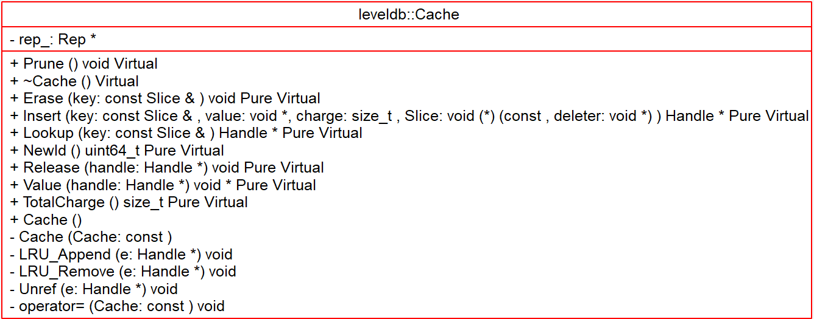
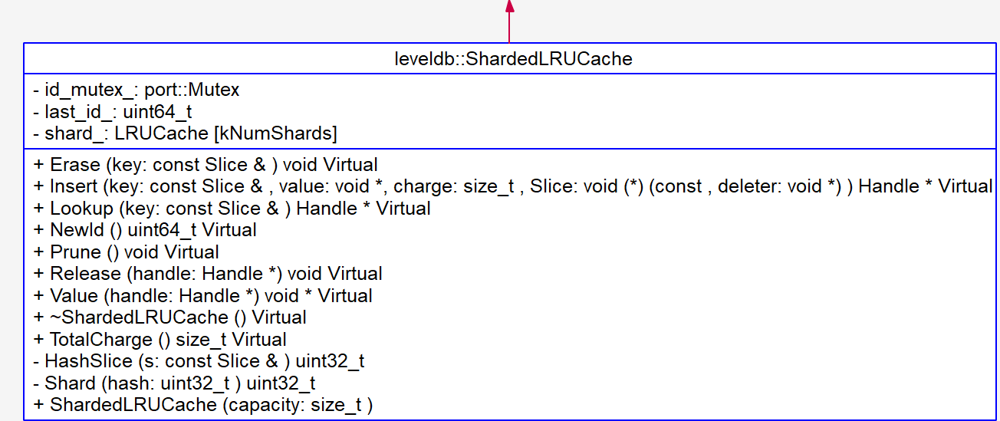
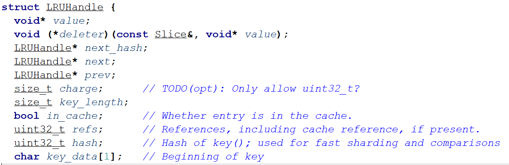
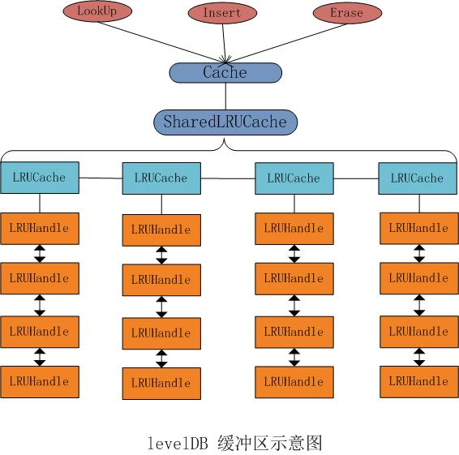

# Cache - 2018-09-20 - rsy

- [模块概要](#module_in_brief)
- [模块功能](#module_function)
- [接口说明](#interface_specification)
- [相关依赖说明](#dependency)
- [内部实现细节](#inner_detail)
- [参考资料](#reference)

## 模块概要
cache.h (include/leveldb/cache.h)   
cache.cc (util/cache.cc)

Cache主要是用来作为kv查询cache部分，主要用于 TableCache(db/tabe_cache.h) 中，

&nbsp;    

## 模块功能

Cache 功能：（保证线程安全）

- Insert // 插入kv返回Handle
- Lookup // 查询k返回Handle
- Value // 传入handle得到对应的value
- Erase // 删除kv
- NewId // 产生一个新id

`ShardedLRUCache`，所谓Shard意思非常简单，就是将所有的请求进行 load-balance。将 `LRUCache` 再做 shard 的目的是为了加速查找和减少冲突。   
整体来看，上层使用 cache 时，首先根据 key 做 shard，然后在 `LRUCache` 层对 `HashHandle` 做数据的 操作，最后处理 lru 逻辑。

&nbsp;   
leveldb 利用上述的 cache 结构来缓存数据。其中：

- cache：来缓存已经被打开的 sstable 文件句柄以及元数据（默认上限为500个）
- bcache：来缓存被读过的 sstable 中 dataBlock 的数据（默认上限为8MB）

当一个 sstable 文件需要被打开时，首先从 cache 中寻找是否已经存在相关的文件句柄，若存在则无需重复打开；若不存在，则从打开相关文件，并将（1）indexBlock 数据，（2）metaIndexBlock 数据等相关元数据进行预读。

&nbsp;    

## 接口说明

对外接口主要是：   
创建工厂：

    Cache* NewLRUCache(size_t capacity) {
        return new ShardedLRUCache(capacity);
    }
需要用户手动 `delete`。   

操作接口：同 `Cache` 接口。

&nbsp;    

## 相关依赖说明

在 TableCache 中的作用：   
https://blog.csdn.net/sparkliang/article/details/8740712  
http://luodw.cc/2015/10/25/leveldb-13/   
http://www.pandademo.com/2016/04/two-stage-cache-of-sstable-leveldb-source-dissect-8/    

&nbsp;    

## 内部实现细节

内部有 `port::Mutex mutex_`(RAII)，保证线程安全。

&nbsp;   
关于 **Handle**：   

Handle是了为了管理cache item。Handle 为空结构体，是因为用于操作的其实是 `LRUHandle`，虽然没有继承，但是 Handle 为空，所以无所谓了。（因为继承空类会被优化掉）

可以看到有3个指针：

- `next_hash`：hash表中的下一个结点。（HandleTable使用链表实现，最后一个结点的next_hash是NULL）
- `next`，`prev`：在LRU双向链表中的数据结构。

所有的 cache 数据都是存储在一个双向 LRU-list 中。LRUHandle是 LRUCache 的管理对象，代表 Cache 里面的元素。LRUHandle一方面在LRU队列里面需要维护指针，一方面在hashtable(HandleTable下面会讲到)需要维护指针。同时存在于LRU队列和HashTable里面。

&nbsp;    
`LRUHandle` 中，`charge` 的作用是记录这条 cache entry 中的 `value` 所指的内存区域大小，cache 的内容有容量限制。   
`LRUHandle->refs` 表示引用计数。为 0 时，表示不在 cache 中；为 1 时，表示在 `lru_` 中；大于 1 时，在 `in_use_` 中，其值减一表示被 clients 引用的次数。   
`LRUHandle` 结构体最后定义了 `char key_data[1];`，此为C程序员惯用手法：[未知大小数组 - 柔性数组](https://zh.cppreference.com/w/c/language/array#.E6.9C.AA.E7.9F.A5.E5.A4.A7.E5.B0.8F.E6.95.B0.E7.BB.84)   
>在 struct 定义中，未知大小数组必须出现作最后一个元素（只要有一个具名成员），这种情况下，这是称为柔性数组成员的特殊情形。

&nbsp;    
**HandleTable 在 resize 时的 lock-free**：   
这个可能要单独拿出来说一下，   
https://leveldb-handbook.readthedocs.io/zh/latest/cache.html#dynamic-sized-nonblocking-hash-table   
http://luodw.cc/2015/10/24/leveldb-11/

&nbsp;    
**LRUCache** 与 **HandleTable**：   
   

每一个 `LRUCache` 都长这样。注意 **虚线连接的是同一个玩意** 就明白了。   
注意：并不是 hashtable 中的所有 `entry` 都有出现在 LRU-list 中（但是 所有 LRU-list 中的 node 一定在 hashtable 中有对应的 `entry`），有的 handle 被 client 持有，属于 in_use 状态。在 handle 被 client 释放后，如果还有引用计数，则重新被加入 LRU-list 头部。当 cache 中的内容被 erase 时，hashtable 和 LRU-list 中都不再出现这一元素。   
**LRU-list 和 in_use-list 的并集是 hashtable**。

&nbsp;    
**ShardedLRUCache**：   
`ShardedLRUCache` 由 16个 `LRUCache` 包装成的 *hash-bucket*，hash 值取最高4位（由 `Slice` 映射到 `uint32_t`）。另外 `Capacity` 由每个 bucket 均摊。   
**为什么需要 `ShardedLRUCache`**：

- 多线程访问
- 快速
- 减少锁开销

下面这个图不太准确：（但是主要想展示 **load-balance** 的想法）    

&nbsp;    

## 参考资料

- [leveldb](https://dirtysalt.github.io/html/leveldb.html#org9904011)
- [leveldb hand-book](https://leveldb-handbook.readthedocs.io/zh/latest/cache.html#cache)
- [leveldb实现解析 - 淘宝-核心系统研发-存储](https://github.com/rsy56640/read_and_analyse_levelDB/blob/master/reference/DB%20leveldb%E5%AE%9E%E7%8E%B0%E8%A7%A3%E6%9E%90.pdf)
- [LevelDB源码分析](https://wenku.baidu.com/view/b3285278b90d6c85ec3ac687.html)
- [LevelDB源码剖析之Cache缓冲区与hash表](http://mingxinglai.com/cn/2013/01/leveldb-cache/)
- [Leveldb源码分析--11](https://blog.csdn.net/sparkliang/article/details/8740712)
- [leveldb源码分析之Table_cache](http://luodw.cc/2015/10/25/leveldb-13/)
- [leveldb源码分析之Cache](http://luodw.cc/2015/10/24/leveldb-11/)
- [SSTable之两级Cache-leveldb源码剖析(8)](http://www.pandademo.com/2016/04/two-stage-cache-of-sstable-leveldb-source-dissect-8/)