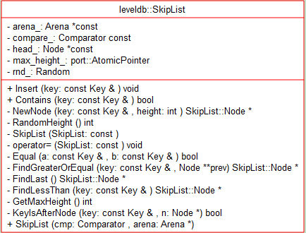
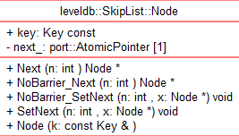
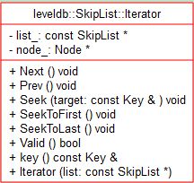

# Module - 2018-10-12 苏胜

- [模块信息](#module_info)
- [模块概要](#module_in_brief)
- [模块功能](#module_function)
- [接口说明](#interface_specification)
- [相关依赖说明](#dependency_specification)
- [内部实现细节](#inner_detail)
- [参考资料](#reference)

&nbsp;   

## 模块信息

SkipList(db/skiplist.h)

&nbsp;   

## 模块概要

leveldb在内存中存储数据的区域称为memtable，这个memtable底层是用跳跃链表skiplist来实现的。redis也采用跳跃链表来实现有序链表。
skiplist的效率可以和平衡树媲美，平均O(logN)，最坏O(N)的查询效率，但是用skiplist实现比平衡树实现简单，所以很多程序用跳跃链表来代替平衡树。
leveldb是支持多线程操作的，但是skiplist并没有使用linux下锁，信号量来实现同步控制，据说是因为锁机制导致某个线程占有资源，其他线程阻塞的情况，导致系统资源利用率降低。所以leveldb采用的是内存屏障来实现同步机制。

&nbsp;   

## 模块功能

skiplist类，用于操作skiplist，增加节点，比较节点等等。

skiplist节点，可以查找下一个节点，可以设置下一个节点。

skiplist迭代器,用于迭代跳表中的节点。

&nbsp;   

## 接口说明

1.SkipList

void Insert(const Key& key) 插入节点。

bool Contains(const Key& key) const   判断链表是否含有某个key值的接口。

Node* NewNode(const Key& key, int height) 新建节点。

RandomHeight() 随机化一个节点高度。

bool Equal(const Key& a, const Key& b) const 判断两个键是否相等。

bool KeyIsAfterNode(const Key& key, Node* n) const 如果key大于存储在“n”中的数据，则返回true。

Node* FindGreaterOrEqual(const Key& key, Node** prev) const 返回key处或key之后的最早节点。

Node* FindLessThan(const Key& key) const 返回小于key的最近节点。

Node* FindLast() const 返回最后一个节点。

2.SkipList:Node

Node* Next(int n)  获取当前节点的下一个节点

void SetNext(int n, Node* x) 设置当前节点的下个节点。

Node* NoBarrier_Next(int n)  无需内存屏障的查找下一个节点

void NoBarrier_SetNext(int n, Node* x) 无需内存屏障的设置下一个节点

3.SkipList:Iterator

bool Valid（）const  如果迭代器位于有效节点，则返回true。

const Key＆key（）const  返回当前位置的键。

void Next（） 移动到下一个位置。

void Prev（） 移动到前一个位置

void Seek（const Key＆target） 使用键> = target前进到第一个条目

void SeekToFirst（） 位于列表中的第一个条目。

void SeekToLast（） 位于列表中的最后一个条目。

&nbsp;   

## 相关依赖说明
需要以下文件：

"port/port.h"

"util/arena.h"

"util/random.h"

&nbsp;   

## 内部实现细节
1.插入操作

插入操作借助于查找操作实现。在查找的过程中，不断记录每一层的前任节点，为新插入的节点随机产生层高；在合适的位置插入新节点，并依据查找时记录的前任节点信息，在每一层中，以链表插入的方式，将该节点插入到每一层的链接中。

链表插入指：将当前节点的Next值置为前任节点的Next值，将前任节点的Next值替换为当前节点。

2.删除操作

跳表的删除操作较为简单，依赖查找过程找到该节点在整个跳表中的位置后，以链表删除的方式，在每一层中，删除该节点的信息。

链表删除指：将前任节点的Next值替换为当前节点的Next值，并将当前节点所占的资源释放。

3.迭代

向后遍历

若迭代器刚被创建，则根据用户指定的查找范围(Start, Limit)找到一个符合条件的跳表节点；

若迭代器处于中部，则取出上一次访问的跳表节点的后继节点，作为本次访问的跳表节点（后继节点为最底层的后继节点）；

利用跳表节点信息（keyvalue数据偏移量，key，value值长度等），获取keyvalue数据；

向前遍历

若迭代器刚被创建，则根据用户指定的查找范围(Start, Limit）在跳表中找到最后一个符合条件的跳表节点；

若迭代器处于中部，则利用上一次访问的节点的key值，查找比该key值更小的跳表节点；

利用跳表节点信息（keyvalue数据偏移量，key，value值长度等），获取keyvalue数据；

&nbsp;   

## 参考资料

 - [leveldb源码分析之Skiplist](http://luodw.cc/2015/10/16/leveldb-05/)
 - [leveldb-handlebook](https://leveldb-handbook.readthedocs.io/zh/latest/memorydb.html#id2)
 - [leveldb](https://www.cnblogs.com/xueqiuqiu/tag/leveldb/)
 - [深夜学算法之SkipList：让链表飞](https://www.jianshu.com/p/fcd18946994e)
 - [leveldb(五)：SkipList跳表](https://blog.csdn.net/weixin_36145588/article/details/76393448)
