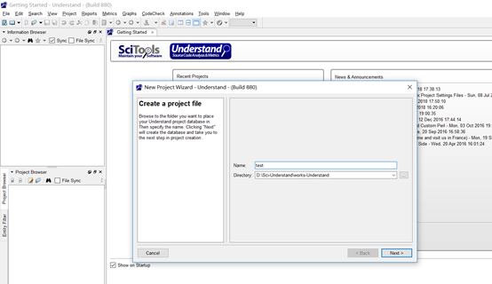
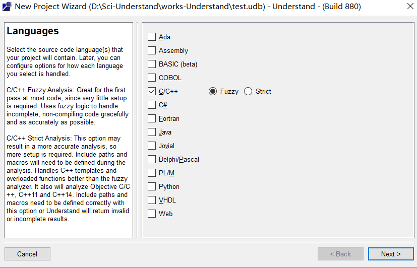
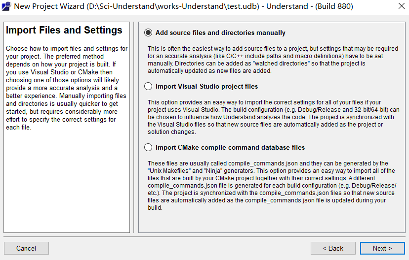
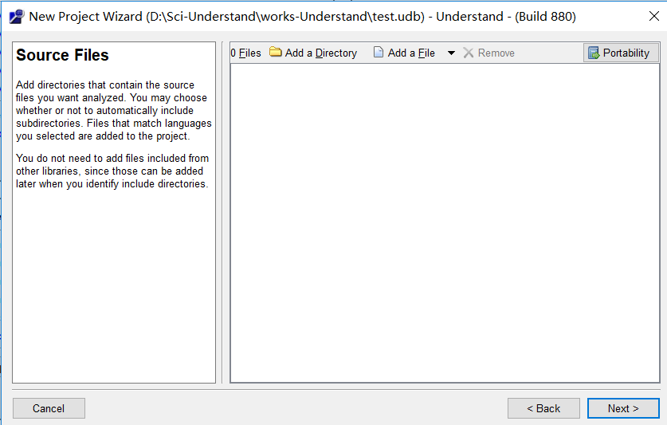
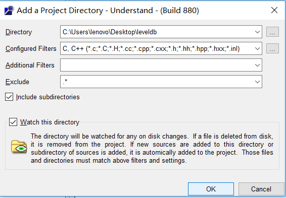
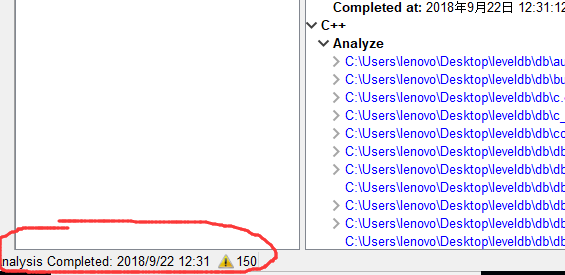
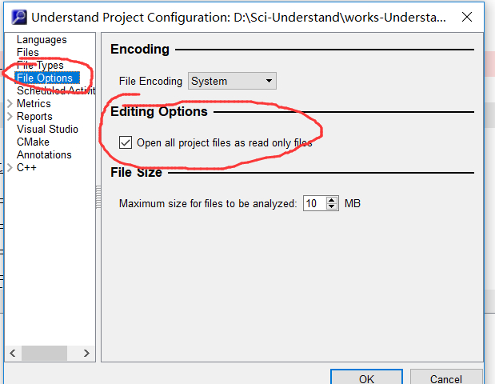
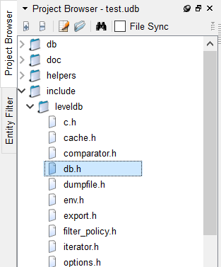
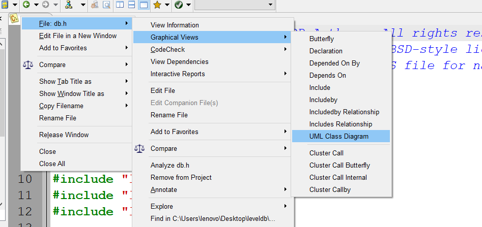
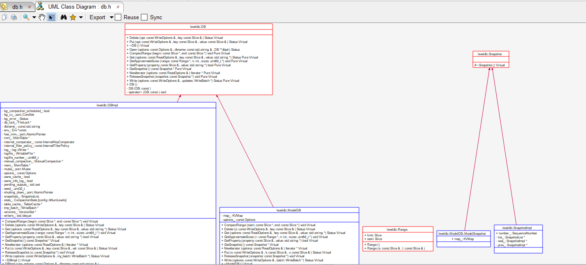

clone [这个仓库](https://github.com/rsy56640/leveldb) 到本地

打开 understand，点击 File -> New -> Project   

  

选择 C++，Fuzzy

点击 Add a Directory

在 Directory 里选择 clone下来的仓库的位置。

完成

额外地，可以选择设置 **只读**，以防不小心修改代码。

点击 Project -> Configure Project

## 关于使用

网上关于 understand 这一强大的源码阅读工具的讲解很多，我在这里列举一些：

打开 include/leveldb/db.h

在 文件 上点击右键，

看到如下图所示的 UML类图（当然，我这个是缩小之后的）

其他的，比如 **搜索**、**跳转**、**查询依赖** 等功能也很强大，就不一一列举了。