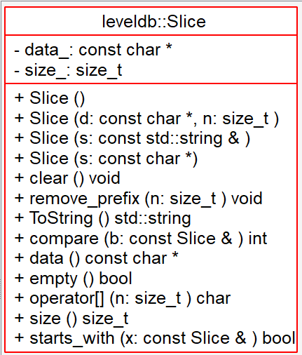

# 项目文档格式说明
-----

文中所有非引用部分均为格式要求部分。引用部分为格式要求的解释。（此句除外）  

>所有文档均采用md格式，推荐使用编辑器 MarkdownPad2 / Typora  
>所有图片均应放置于与文档同目录下的 `assets` 目录下   

- xxx 编辑于 2018-09-16
  - ...
  - 123
- xxx 编辑于 2018-09-17
  - asd

>文首应记录 **编辑者**，**编辑时间**，**编辑内容**    
>若不同成员欲修改同一文档，事前在群里商量好    

- [模块信息](#module_info)
- [模块概要](#module_in_brief)
- [模块功能](#module_function)
  - [存储部分](#storage)
  - [压缩部分](#compress)
  - [日志部分](#log)
- [接口说明](#interface_specification)
- [相关依赖说明](#dependency_specification)
- [其他](#other)

>除非相关模块过于简单、朴素，像   [Slice](https://github.com/rsy56640/read_and_analyse_levelDB/blob/master/architecture/DB/Slice%20-%202018-09-16%20-%20rsy.md)   
>否则应写出简要链接和导向来帮助阅读

## 模块信息

Slice.h (include/leveldb/slice.h)  
对字符串指针做了简单的封装。  

>信息包括 **文件名**，**路径名**（所有路径均相对于 google/leveldb），**介绍** 等。

## 模块概要

为操作数据的方便，将数据和长度包装成 Slice 使用，直接操控指针避免不必要的数据拷贝。

概括地讲：`leveldb::Slice` 是个轻量级的 `std::string`.

>一两句话介绍模块

## 模块功能

Specification:

1. 所有操作均有边界检查。
2. `void remove_prefix(size_t n)`：向后移动 n 个byte， size 减少 n.
3. `bool starts_with(const Slice& x)`：判断前缀是否与 x 吻合。

>最好有UML类图（可以使用Understand自动生成），**图片名称应为内容+日期**（避免混乱，比如这张图叫做 Slice_09_16.png）   
>核心部分还可以附加流程图说明   
>所有图片均应放置于与文档同目录下的 `assets` 目录下   
>最好有解释，大部分内容头文件中都有，把重要的接口描述清楚   
>实现文件的内容可以不用出现，除非有核心功能的组件  

### 存储部分

### 压缩部分

### 日志部分

## 接口说明

>说明接口的功能，主要在什么地方使用     
>
>某些接口可能会*改变系统状态*（不那么local的状态，即比较全局的状态）   
>对于这样的接口，**必须**描述清楚：！！！！！！！！！！！！！！！！！！！！！！！！！！！！！！！！！！！！！！！！！！！！   
>**调用接口前系统的状态**，保证进入模块时所有环境是正常的（怎样算正常，如某些参数要有什么样的保证！！！比如全局状态，环境变量，错误处理函数，日志文件，缓存一致等，，，尤其全局状态之间可能存在复杂的联系）   
>**调用接口后系统的状态**，即调用完成后保证这些变量处于什么样的状态！！！！！！（还是同一批变量）     
>
>注意到一个模块调用前的状态，很可能是另一个模块调用后造成的（即整个流程对于全局状态的修改有着怎样的逻辑关系，以及是怎样维护这些状态的），可以对此做一些探究并给出说明

&nbsp;    
&nbsp;    
&nbsp;    

>上述部分，如**模块概要**，**模块功能**，**接口说明**，若差别不大，则可以不用分得这么细，只要把模块理清楚就行  

&nbsp;    

## 相关依赖说明

>描述该模块用于何处，表现出何功能   

## 其他

>对于一些实现技巧，架构手法，设计理念，各种设计模式的补充说明   
>例如 C++ 中常见的有 RAII, copy-and-swap, erase-remove, pImpl, 和各种 pattern 等   
>使用了什么数据结构和算法，优越性在哪里，是否有其他的实现方式，**trade-off** ？？？    
>参考的文献

